# Ruan Mei Lore Analysis
##### *Written by mr.swedishfish and euphriia, Edited by rei_dayo* | MANY SECTIONS ARE UNDER CONSTRUCTION
> *"Life exists during a very short window of time, all destined to wilt in the end."*

## Introduction
> *"Ruan Mei possesses extraordinary perception and cognitive integration abilities, easily capturing microscopic details of reality and synthesizing them into a torrent of information within her mind."*
>
> — The IPC, about Ruan Mei

Ruan Mei is referred to by several different titles by other people: biologist, mad scientist, hermit, musician, dessert aficionado, master of creation, and many more. Some may describe her as an elegant and admirable scientist who has achieved incredible scientific feats. Others think of her as a hermit with unethical experimenting methods and a lack of empathy.

As someone who never reveals her true intentions or character, it is difficult to truly understand who Ruan Mei truly is. What are her motives? What is her true goal? Why does she act the way she does? She is a mystery, shrouded in uncertainties. Here, we take a deeper dive into Ruan Mei's character, who she really is, and possible theories surrounding her.

<figure markdown>
  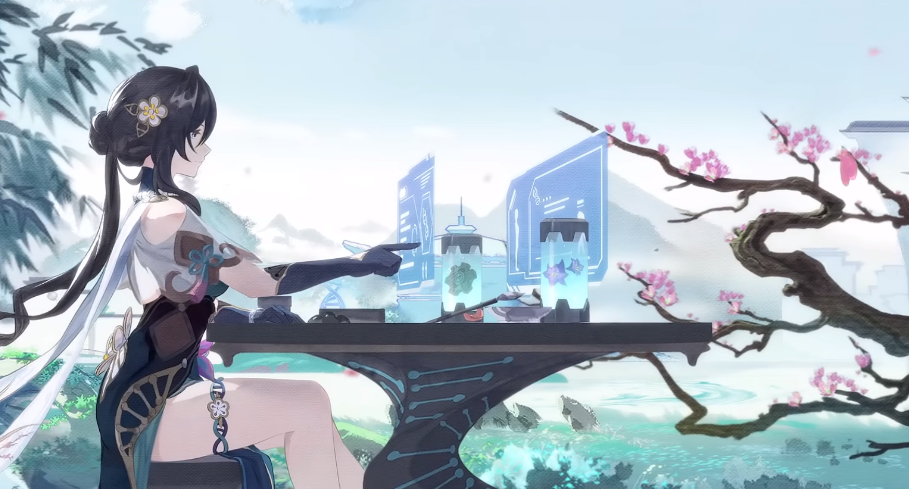
  <figcaption>Elegant, artistic, and intelligent. Let's learn more about Ruan Mei!</figcaption>
</figure>

## About Ruan Mei
### Character
> *"My name is Ruan Mei. When saying my name, please don't run the syllables together."*

Ruan Mei is Member #81 of the Genius Society, specializing in biology and life sciences. She works alongside Herta, Screwllum, and Stephen Lloyd to create the Simulated Universe. Herta describes Ruan Mei as a "master of creation," as she specializes in developing organisms and the life sciences. This is reflected in her skill animations, hairpins, dress designs, garter, and bracelet, which are all shaped like DNA helixes.

<figure markdown>
  
  <figcaption>Even Ruan Mei's window is DNA-themed!</figcaption>
</figure>

Ruan Mei is described as an elegant and ambitious genius. She will do anything to study her research topic, even sacrificing basic needs for the sake of science — her Character Story II states that "She was so engrossed in her research that she never ate regularly." 

Ruan Mei is also very meticulous and thoughtful, which is reflected in her skills in embroidery, music, and even laboratory work. This is further illustrated by how Ruan Mei gifted Asta a hand-embroidered charm after Asta complimented it. In When the Stars of Ingenuity Shine, she also states "A single error in detailed research can generate issues, and I despise matters that escape my control."

While Ruan Mei is a scientist, she enjoys the arts and desserts as well. Ruan Mei loves traditional theater and opera, and she plays a ruan, a Chinese stringed instrument. She is also known to love desserts, and she can almost always be seen eating a pastry. According to one of her lines in "When the Stars of Ingenuity Shine," she enjoys the drinks of fellow Genius Society member, #55 Yu Qingtu. 

### Personality
> *"The redundancy of words and the restrictions of verbal communication make for a lot of empty noise. It makes me sad..."*

Ruan Mei is shown to be very introverted. She dislikes talking to people more than she needs to and is a solitary person. She has long since left behind her past, as well as taking on a new name. When she joined the Genius Society, she hid herself in a secret corner of the universe for her research so she could conduct it without interruptions. After receiving the gaze of Nous, it is said that she became a recluse, and that "she became even more apathetic and impassive, and even more immersed in her research."[^5] She also made sure to enter and leave the Herta Space Station quietly, avoiding all the researchers who wanted to greet her.

Ruan Mei lacks empathy and doesn't form closer relationships with anyone. According to her, "I do not have a life outside of research. People always think this price is unimaginable, but it seems rather acceptable to me."[^7] She also does not feel an attachment to the lifeforms she creates, despite them having a strong attachment to her, and does not know what to do with them most of the time. Due to her past, Ruan Mei has learned to not trust anyone, causing her to act superficially and avoid people altogether. This can also cause her to be overly cautious when dealing with others.

<figure markdown>
  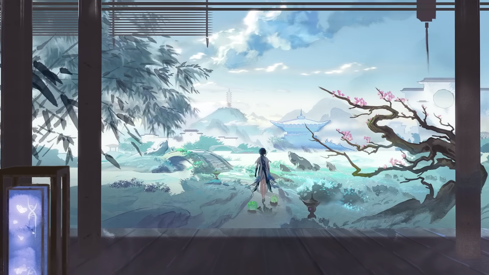
  <figcaption>Ruan Mei is a solitary person who enjoys being alone.</figcaption>
</figure>

> *"She is certain that she won't make another mistake. It's because she no longer trusted anyone, so she won't be let down again, and... she won't let anyone else down again."*
>
> — Ruan Mei Character Story: Part IV

Despite this, Ruan Mei is able to put up a good facade in front of others. She clearly understands what society decides is right or wrong, even if she herself does not have any moral direction. She will never say anything rude, nor does she try to make people upset, as this is not pragmatic nor conducive to any of her goals. Ruan Mei uses this understanding to her advantage by saying and doing things to please people when it benefits her.

This behavior stems from her understanding of "love." As a child, Ruan Mei understood that love came in different forms. One type of love, the one she particularly liked the most, was love by reward. When she was small, Ruan Mei preferred to do things when rewarded with her favorite snacks and desserts, and would look forward to her "rewards" after coming back from scientific expeditions. As such, her favorite type of love was her Aunt's, as she would buy little Ruan Mei snacks. This view of the world meant that she quickly realized that to get people to do what she wanted them to do, she needed to give them an incentive.

In the Simulated Universe, Ruan Mei is best known for her famous Occurrence, one that gives either all blessings of a certain Path or 2000 Cosmic Fragments (which is a large amount). With the Occurrence, it obviously becomes much easier to complete the Simulated Universe run. Getting her Occurrence usually causes most players to become excited because of rarity and because they know that it will help them immensely. Because of this, some people associate Ruan Mei with an image of generosity.

<figure markdown>
  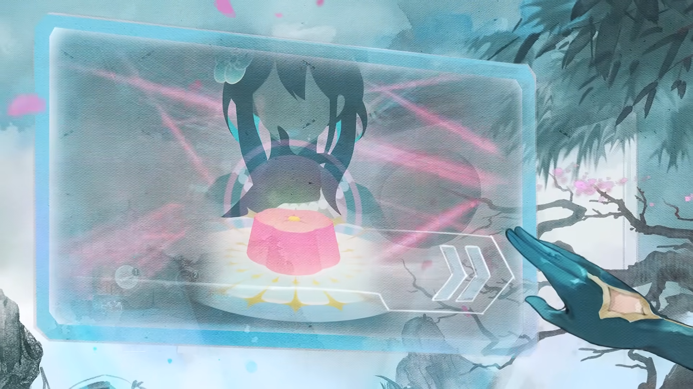
  <figcaption>Ruan Mei makes sure to reward the Trailblazer with her Occurrence.</figcaption>
</figure>

> *"Perhaps I'll encounter new friends in the meantime, but I'm not sure... I sometimes wonder whether I'm able to get along well with others."*
>
> — Ruan Mei, about close relationships

This is the incentive Ruan Mei gives to the playerbase, the Trailblazer. Her Occurrence is an example of the "reward" she gives us in order to make the Trailblazer do her bidding. This, along with Ruan Mei's sweet words and actions, gives the Trailblazer an illusion of receiving "love" from her. Even if she does not truly care for the Trailblazer, or anyone for that matter, she understands that the Trailblazer is useful to her, and she acts accordingly to gain what she needs from the Trailblazer.

Is this manipulation? Yes, it is. However, Ruan Mei does not find anything wrong about this. As long as both sides gain benefits and are satisfied, there is no problem for her. Ruan Mei rewards the Trailblazer for helping her, and if the Trailblazer isn't satisfied, she will simply offer more rewards. To Ruan Mei, that is what "love" is. She does not understand such emotions on a deeper level and herself admits that she doesn't understand "love." All she has learned is that living beings will do anything when given the proper incentives. She uses this to her advantage, noting that "Children will become more well-behaved when they see random rewards."[^1]

Ruan Mei also generally finds emotions and human sentiments, such as attachment, love, and relationships with others, an inconvenience. In her Myriad Celestia Trailer, she states that "'Attachment' involves the insular cortex, which controls anxiety and pain...The laws of "emotion" can be easily broken down." To Ruan Mei, emotions are simply unnecessary and something that hinders living beings.

<figure markdown>
  
  <figcaption>Ruan Mei believes that emotions and attachment are unnecessary.</figcaption>
</figure>

Due to her nature as a scientist who trusts only her research, Ruan Mei expresses visible dissatisfaction with the capriciousness of emotions and views attachment similarly. When her parents died, a major takeaway of hers was that "Only science... never lets anyone down"[^4]. Furthermore, when explaining to the Trailblazer why she elects to remove their memory, she states that the connection between her and the Trailblazer, an inherently complex one, will be destroyed. Ruan Mei also states that she thinks this will be more relaxing for both parties, as to her, having an emotional connection with someone is bothersome.

Ruan Mei's Character Story II also indicates that although she does not understand it, Ruan Mei does feel deeper emotion, as she expresses visible grief in the face of her parents' death. However, her form of grief is different than the typical idea one conjures when thinking of "grief." She does not cry; instead, she views the situation as a "let-down" and a chain of failed promises. She understands how she is "supposed" to feel according to society's expectations, but she does not feel that way herself. Nevertheless, their deaths catapulted Ruan Mei into a period of obsessive research, and she took their names (Ruan and Mei) as her own in tribute. 

### Research
> *"When I discovered how easy it was to cultivate a 'planet,' I began to feel... empty. I increasingly understand that I long for more fundamental research."*

Ruan Mei's research is centered on the topic of life and its "essence." She also seems to have an interest in immortality, stating that "Life is countless and varied in form...Its beauty is like a myriad of flowers, and I want to pluck the one that never wilts."[^7] 

Ruan Mei firmly believes that life, while taking on a variety of forms, is always the same at its very core. According to her, all life is simple underneath its exterior. She endeavors to find and understand this kindling of life and believes that when she does, many of the questions she has posed will be solved. If one were to trace life back to its very roots, she believes that only one equation is necessary to solve the mysteries that life has to offer. 

<figure markdown>
  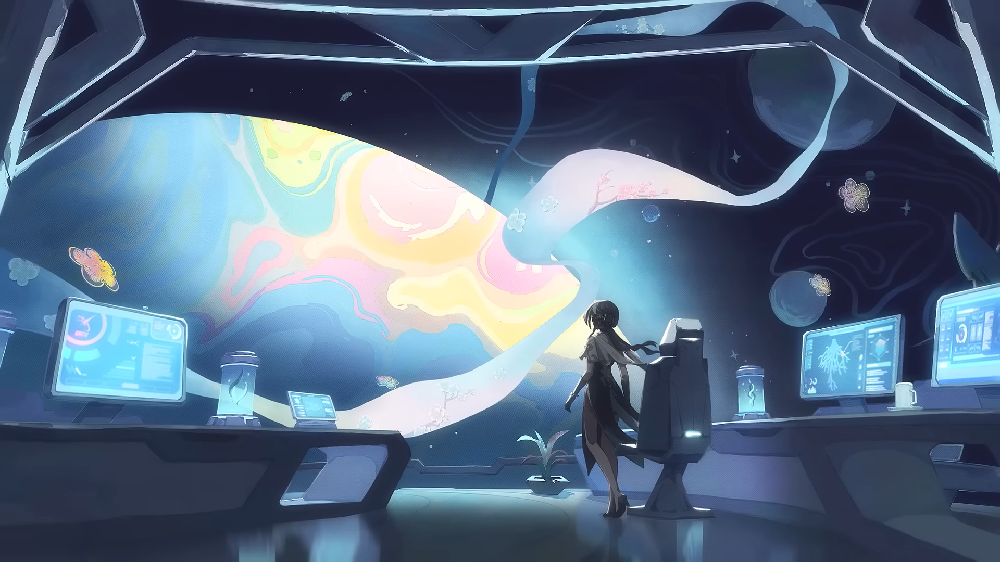
  <figcaption>Ruan Mei only cares about her research: finding the origin of life.</figcaption>
</figure>

Ruan Mei is shown to neither care nor know what to do with the results of all of her experiments. This can be seen with the life forms she creates that the Trailblazer encountered, as well as her research with biology on other planets. She frequently breaks the known laws of life and leaves experimental sites with an explosion of seemingly impossible results. 

Despite this, she doesn't seem to care and views her growing reputation for her groundbreaking studies as a nuisance. Ruan Mei, unlike Herta, prefers to stay away from the limelight and dislikes any praises or publicity she receives from her research. She also views much of research as too insignificant for her: she was disappointed by how easy cultivating a planet was and longed for something more "fundamental."

After her encounter with Nous, Ruan Mei became increasingly interested in the Aeons and became even more obsessive with her research. At this point, part of her intense perseverance is to draw the eye of Nous again, as it seems to have been an incredible experience for her. Aeons (and their Emanators) fascinate Ruan Mei, and the only reason she accepted her invitation to the Genius Society was so she could research more about the Aeons in the Simulated Universe. This constant drive can also cause her to feel lost and confused at times since her experiments are coming to a standstill, as can be seen in the Trailblaze Mission before she decides to emulate an Emanator.

### Themes and Motifs
> *"Life... it always adapts to the harsh environment and grows with tenacity... Therein lies the miracle."*

Ruan Mei's overall design theme is based on plum blossoms. The character "Mei" in her name, 阮 梅, shares the same character 梅 (meaning plum) as in 梅花, or meihua, meaning plum blossom. Plum blossoms can also be seen in almost any official artwork having to do with Ruan Mei. Furthermore, Ruan Mei plays a ruan, a Chinese stringed instrument seen in her official artwork, and it is used as her weapon of choice.

<figure markdown>
  
  <figcaption>Ruan Mei plays a ruan, and her themes are based on the meihua.</figcaption>
</figure>

While Ruan Mei's name is based on the two defining themes of her character, it also comes from her two parents' last names, which she chose to replace her original name after her parents' deaths. This is why her name is separated by a space, and why she's very particular about the space being enunciated.

In Chinese culture, plum blossoms symbolize perseverance, as they are one of the few flowers that bloom in the winter. This parallels Ruan Mei's fascination with life and its resilience to adversity, as well as the "terrifying perseverance" she displays toward her research. She was so intensive in her research that she caught the attention of Nous, the Aeon of Erudition. Plum blossoms representing the end of winter and the start of spring may also be why Ruan Mei is an ice-type character.

## Affiliations
### Genius Society
> *"You don't have to listen hard to hear the gossip coming from the Genius Society — Mad Scientist. I'll take it as a compliment."*
>
> — Ruan Mei, about the Genius Society

Initially, Ruan Mei did not want to join the Genius Society, viewing it as an interruption to her life as a recluse. She even threw away the invitation that she received from them. It was only after Herta invited her to work on the Simulated Universe, and by extension the study of Aeons, that she accepted the invitation.

<figure markdown>
  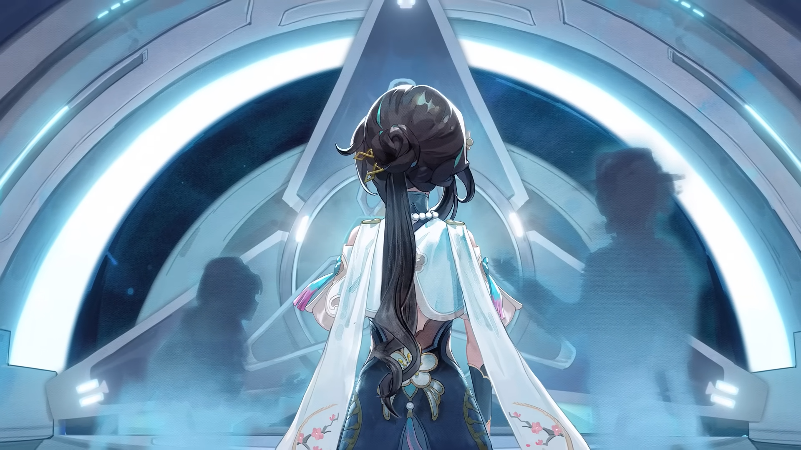
  <figcaption>Ruan Mei, like the other Genius Society members, is quite aloof.</figcaption>
</figure>

After her encounter with Nous, Ruan Mei seems to have experienced a burning fascination with Aeons and an even deeper interest in "life." According to her Character Story IV, "Only the word 'Aeon' can stir her heart. Everything else in the universe is a mere distraction." As such, she viewed everything else about the Simulated Universe as not worth her time. She did, however, enjoy the meetings between her, Herta, Screwllum, and Stephen Lloyd. 

Ruan Mei is known to have contributed to the Simulated Universe DevLog for Lan, the Aeon of the Hunt, since Herta couldn't find any records on Lan in the IPC.

### Hometown
> *"Starting from their home, a planet blessed by Abundance, they boarded research aircraft and set off to more worlds."*
>
> — Ruan Mei Character Story: Part I

Not much is known about Ruan Mei's home planet. Even Ruan Mei herself has forgotten her home after spending so much time researching. According to Ruan Mei's Character Story II, "...whenever someone asked her about her 'home,' there would be a flash of confusion in her eyes. She seems to have forgotten everything." She does not feel any connection to her roots, and she left her home behind when she was accepted into the Genius Society.

As a child, Ruan Mei explored other worlds with her mother to go on scientific expeditions. She would research other forms of life in those planets she visted, and she would try to find evidence of life in barren places such as No Man's Land, the icy planet depicted in her Myriad Celestia Trailer. However, due to Ruan Mei leaving her home and visiting other places at such a young age, she did not feel attached to her own home world.

<figure markdown>
  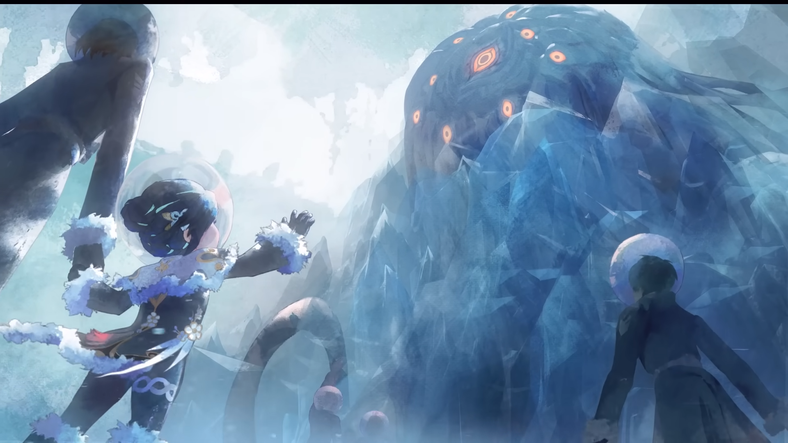
  <figcaption>Ruan Mei's home planet was one blessed by the Abundance.</figcaption>
</figure>

> *"The soft wind beckons the early spring, a joyous mood does it bring. A chill wake from rest, the plum blossom in a mess. Where is the home I miss, only remembered in drunken bliss."*

Despite not remembering much about her homeland, Ruan Mei has acknowledged that her homeland was a place that fascinated her. She states that "with its pristine waters, my homeland is like a tapestry of wonders." This could be a metaphorical description, alluding to how the planet might have been teeming with life. It could also be a literal recollection of the planet, illustrating how the nature and physical appearance of her home may have been beautiful.

It is possible that No Man's Land is Ruan Mei's home. The Data Bank explains that Ruan Mei was born on a planet covered in ice. However, it is possible that it is not, as in the Trailblaze Mission featuring her, the Trailblazer is given the option to ask whether she has researched there before. She responds that she and her mother spent 11 polar nights there. The possibility of this being her home cannot be completely eradicated, still, as she doesn't seem to have much recollection of her home.

Ruan Mei also may be from the Xianzhou Alliance, due to her home world being blessed by the Abundance and her Chinese roots, as well as the fact that Ruan Mei helped provide information on Lan for the Simulated Universe. The Data Bank also supports this conclusion by stating that Ruan Mei has been seen in Xianzhou before. However, this is not confirmed, either, and Ruan Mei has never mentioned anything about the Xianzhou Alliance. There is not enough information to conclude where exactly Ruan Mei's home planet is, or if it even exists anymore.

### Simulated Universe
> *"I nurture the prototypes of the universe and the Aeons."*
THIS SECTION IS UNDER CONSTRUCTION.

### Other Experiments
THIS SECTION IS UNDER CONSTRUCTION.

## Relationships

### Genius Society Members
> *"She turned to look at the letter from the Genius Society on the desk and, once again, dumped it into the trash can."*
>
> — Ruan Mei Character Story: Part III

Ruan Mei's relationship with the Genius Society is questionable at best. Of course, as the Genius Society is full of socially inept introverts, Ruan Mei also being one, she does not bother to interact with or befriend other members. Due to joining the Simulated Universe project, she was forced to socialize with Herta, Screwllum, and Stephen Lloyd, all of whom she seems indifferent about. She does slightly enjoy their meetings at times, but that is about its extent. The only other Genius Society member Ruan Mei has been known to interact with is Yu Qingtu, whom Ruan Mei is good friends with.

>*"I might not refer to them as friends — once the Simulated Universe project is over, chances are we'll part ways... but I'm grateful to Herta for always granting me some leeway on the space station."*
>
> — Ruan Mei, about Herta, Screwllum, and Stephen

<figure markdown>
  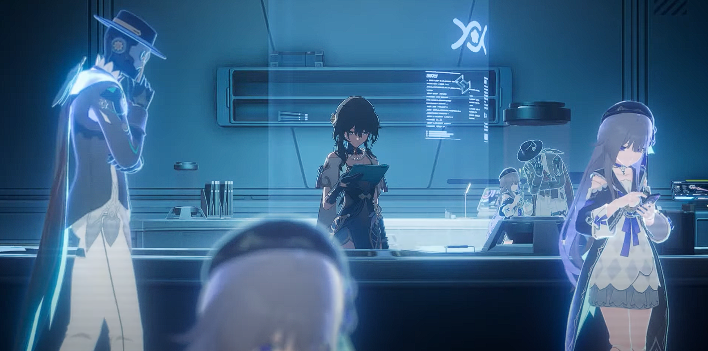
  <figcaption>Ruan Mei maintains a work-relationship with the Genius Society.</figcaption>
</figure>

=== "Herta, #83"
    > *"Some may find her personality unbearable — I can understand the sentiment, but I simply don't care. Of course, Herta knows this too, so I accepted her invitation."*
    >
    > — Ruan Mei, about Herta

    Ruan Mei and Herta respect each other as colleagues. They trust each other on a work level and acknowledge the talents and achievements of the other. However, neither cares enough about the other to get closer than that. Herta is someone who is very focused on the projects she is interested in, and she will ignore everything else she deems not worth her attention. Similarly, Ruan Mei is only interested in her own research topics, and while she will do anything to advance her research, she will not try to get close to anyone she works with.

    <figure markdown>
      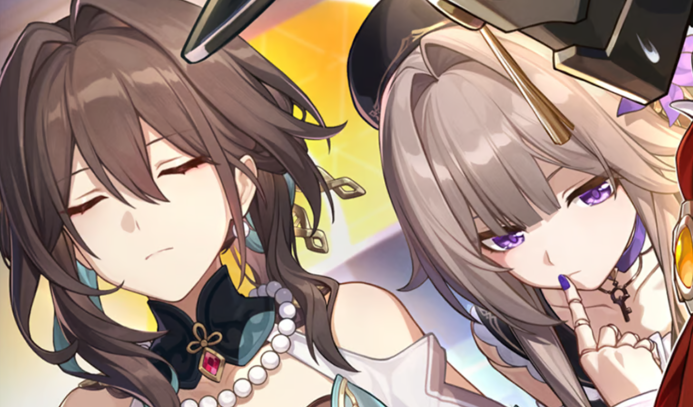
      <figcaption>Ruan Mei and Herta often work together for the Simulated Universe.</figcaption>
    </figure>

    > *"This is a strange, instinctive feeling. That one named 'Herta' is rather similar to me. I mean... similar on a deeper level."*
    >
    > — Ruan Mei Character Story: Part IV

    Herta and Ruan Mei regard each other as equals. When asked by the Trailblazer if Ruan Mei is a great person, Herta responds, "That's like asking 'Is Herta a great person?' The answer is obvious!" She even regards Ruan Mei as a "master of creation" and someone who is very capable, ambitious, and intelligent. While Herta may be competitive and often thinks she is the best, she does not deny that Ruan Mei's achievements are incredible. Still, she may be blunt about Ruan Mei, such as when she finds it hilarious that the IPC described Ruan Mei as "lowkey" or when she points out that Ruan Mei only accidentally saved an ecosystem because it was an unintentional byproduct of her research.

    When Ruan Mei first met Herta, she felt indifferent and even annoyed by her. She only joined Herta's Simulated Universe project because it would help Ruan Mei research more about Aeons. However, over time, she learned to interact more with her colleagues. Ruan Mei realized that she and Herta were both people who would ignore anything for their research, and she felt closer to Herta because of this similarity. While studying Aeons is still her top priority and her motivation to continue the Simulated Universe project, she also is willing to work with Herta. The success of Herta's project shows that they work well together, even if they may not interact often outside of work matters.

=== "Screwllum, #76"
    > *"Screwllum and I have very different understandings of life, but I don't think he realizes it. Fortunately, our communication is limited to matters related to the Simulated Universe."*
    >
    > — Ruan Mei, about Screwllum

    Ruan Mei and Screwllum certainly have very opposing ideas about life. One is a biologist who cultivates living organisms, while the other believes in supporting the rights of mechanical beings. While they both acknowledge and respect each other's beliefs, they do not consider each other as friends. They simply have a work relationship.

    Ruan Mei's understanding of life is quite literal. A living being must be organic with the ability to grow, breathe, reproduce, and most imporantly, die. She views experiences such as emotions unnecessary and contradictory. Contrastingly, Screwllum believes in life in a metaphorical sense. One is truly living if they are experiencing and fulfilling life's moments. It doesn't matter if they are alive, it matters if they are living their life.

    <figure markdown>
      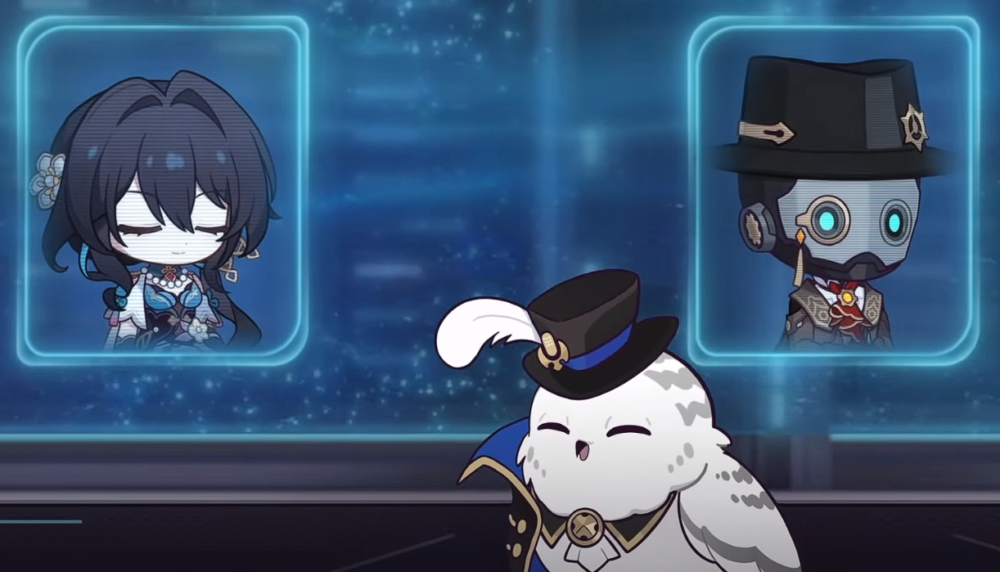
      <figcaption>Ruan Mei and Screwllum respect each other despite different beliefs.</figcaption>
    </figure>

    > *"Though I and Miss Ruan Mei have drastically different understandings about life, I completely comprehend her love for the life sciences."*
    >
    > — Screwllum, about Ruan Mei's understanding about "life"

    An example that displays Ruan Mei's sense of literalism is in the *Geniuses' Repose* light cone. Screwllum is perfectly capable of eating "normal" food that humans eat. In fact, he even enjoys them. However, during their dessert break, Ruan Mei served Screwllum machine oil instead of tea and pastries. Because he was a robot, she did not acknowledge his ability to consume food like a living being.

    However, both respect their differences in beliefs, and it is due to these very differences that they work together well when creating the Simulated Universe. Ruan Mei is in charge of creating the lifeform simulations, the creatures that live and breathe and interact with the Trailblazer, while Screwllum is in charge of the mechanical and engineering aspects of the project.

=== "Stephen Lloyd, #84"
    > *"Put a watermelon parfait in Herta's office and Stephen is sure to show up. Remember, the pumpkin ones will never attract him — those are for warding him off."*
    >
    > — Ruan Mei, about Stephen Lloyd

    Due to Stephen Lloyd's extremely avoidant personality as well as Ruan Mei's introverted behavior, the two do not seem to interact very much. However, due to Stephen Lloyd's background in running fruit stands, he seems to enjoy fruit-related foods. Because Ruan Mei enjoys pastries, enjoying desserts may be something the two may have in common.

    > *"Stephen is a kind-hearted boy, always making one feel compelled to look out for him."*
    >
    > — Ruan Mei, about Stephen Lloyd

     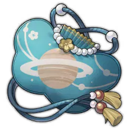{ align=left } Ruan Mei talks about Stephen Lloyd as if he is some sort of creature that needs to be studied. She talks about baiting him with desserts to "summon" him or using a pumpkin parfait to "ward" him off. While this is quite consistent with her personality, as Ruan Mei does not really care about concepts such as empathy and humanity, the way she acknowledges him is still different from the other Genius Society members such as Herta or Screwllum. It may be due to the fact that the two hardly ever interact, nor do they ever seem to need to interact, that Ruan Mei finds him almost unfamiliar and unknown.

    The only connection that Ruan Mei and Stephen Lloyd have is Ruan Mei's curio, the A-Ruan Pouch. Ruan Mei created this curio in order to "carry the universe in her pocket," though she had to seal it when its dimensionality kept expanding. Stephen Lloyd considered this curio as his most important companion due to the fact that he could hide inside it to avoid his family.

=== "Yu Qingtu, #55"
    > *"Yu Qingtu, Genius Society's #55, has an impressive taste in music. On account of her fantastic friendship with Ruan Mei, she once made a drink — to which she gave an eye-catching name taken from the title of her favorite ancient Amber Era music — as a gift."*
    >
    > — *The Pinkest Collision* Curio

    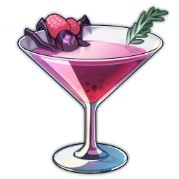{ align=left }

    Yu Qingtu, #55 of the Genius Society, is known to be Ruan Mei's very close friend. Ruan Mei herself has stated that she enjoys her time with Yu Qingtu every time they meet, which is quite out of character for a known hermit who does not enjoy being around people.

    When discussing which member of the Genius Society should be the fifth contributor to Herta's Simulated Universe Project, Yu Qingtu was brought up. Herta noted that she was someone very dear to Ruan Mei, but she did not know if she was still alive. Ruan Mei did not confirm Yu Qingtu's status, so her whereabouts are unknown.

    Though there isn't a lot of known information about Yu Qingtu, it can easily be understood why Ruan Mei and Yu Qingtu may get along well. Both enjoy music; Ruan Mei plays the ruan and enjoys traditional opera while Yu Qingtu "has an impressive taste in music"[^8]. They both also enjoy creating food-related things. Ruan Mei loves tasting and making desserts, and Yu Qingtu is known for mixing cocktails. It can be inferred that the two enjoy the finer things in life, like the arts and fine dining.

    One of Yu Qingtu's Simulated Universe curios, The Pinkest Collision, refers to a cocktail that Yu Qingtu created for Ruan Mei as a gift. The curio increases the user's Break Effect, which works well with Ruan Mei's skills.

    It is likely that due to Ruan Mei's introverted and hermetic nature, she may not have any other friends except for Yu Qingtu.

### Aeons

=== "Nous"
    >*"She kept pushing herself for a more in-depth understanding of 'life,' just to bring herself closer to Nous — and their unforgettable glance."*
    >
    > — Ruan Mei Character Story: Part III

    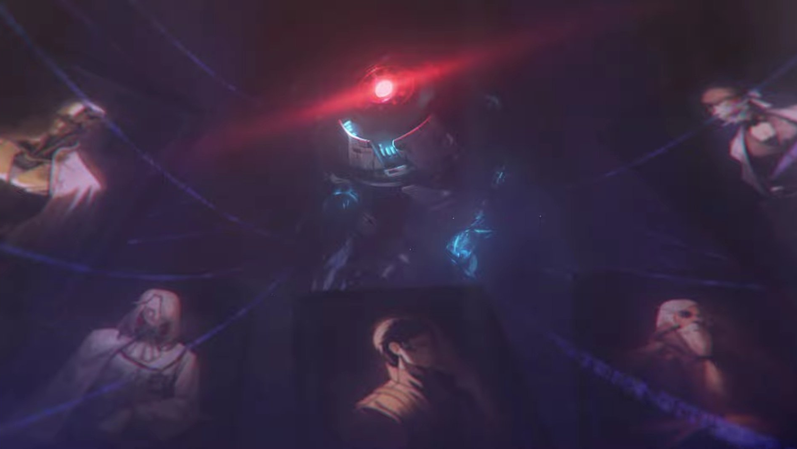

    THIS SECTION IS UNDER CONSTRUCTION.

=== "Tayzzyronth"
    > *"Tayzzyronth the Propagation! I don't know why Ruan Mei is so interested in them. Perhaps because they made such a ruckus with the Swarm Disaster they created."*
    >
    > — Herta, about Tayzzyronth

    

    THIS SECTION IS UNDER CONSTRUCTION.

### Family Members

=== "Parents"
    > *"In the grand fabric of life, both parents are equal, and thus my name takes the last name of each of my parents."*
    >
    > — Ruan Mei, about her name

    Ruan Mei's relationship with her family is quite odd. She allegedly was raised in a "loving" household,  and "her life in a tiny house with her family of science enthusiasts was filled with love," according to her character story. However, Ruan Mei's understanding of love changes over time from the emotional traditional kind to something more of an "equivalent exchange" relationship. Eventually, Ruan Mei favored her aunt over her other relatives, because she would buy Ruan Mei snacks. Ruan Mei learned that the "love" that mattered the most was the kind where there was personal benefit to it. She would only accept this kind of "love" as she grew older.

    <figure markdown>
      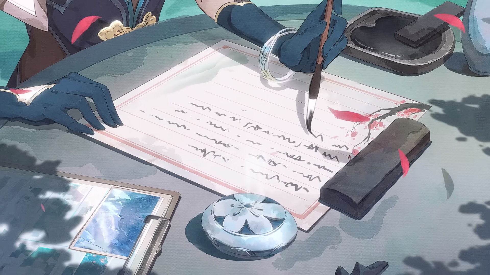
      <figcaption>Ruan Mei is shown writing to her mother about their past.</figcaption>
    </figure>

    While Ruan Mei states that both parents are equal, she clearly spends more time with her mother. She states herself that "my father was a sculptor, but it was my mother's passion for research that I shared." Ruan Mei's other was a "scientist," with quotes. It could imply that she loved research and science, but didn't hold a degree in it. It could also imply that she never made any major scientific breakthroughs. Nonetheless, while Ruan Mei's interests align with both her parents, being a biologist and an artist, she shares a stronger connection with her mother.

    As Ruan Mei grew older, her mother became more strict with her. They would roam around the planet, searching for traces of life and researching them. They never become emotionally closer through these expeditions, but Ruan Mei would receive rewards for her efforts, or "love." Judging from Ruan Mei's story, however, it seems as if she has inherited more of her mother's characteristics, at least personality-wise. They both are passionate about the sciences, and they both seem to have an eccentric personality. Ruan Mei states that she holds onto a piece of her mother's brain tissue, upon her mother's wishes. The reason for this is unknown, but it definitely sheds light on what kind of person Ruan Mei's mother was.

    The love Ruan Mei felt towards her parents might as well been very real, but the way it was expressed was quite complicated. When her parents died, Ruan Mei definitely felt some form of grief towards them. She did not shed any tears at their funeral, but she felt a sense of regret when they passed away. She states that "this is a let-down. They failed to keep their promise with Grandma. And I, too, let them down for failing to protect them as promised." While it sounds as if Ruan Mei had an obligation of some sort having to do with her family, it is very possible that Ruan Mei also felt grief and sadness upon her parents' deaths. After all, she changed her name to their last names after their deaths.

=== "Grandmother"
    > *"Unbeknownst to the girl, her grandmother has always been watching her through the monitor, day after day for countless years.*
    >
    > *'A-Ruan... My A-Ruan. When we finally meet again, would it be...?'"*
    >
    > — Ruan Mei Character Story: Part IV

    THIS SECTION IS UNDER CONSTRUCTION.

### Others

=== "Lifeform Creations"
    > *"Some living things concocted from 'knowledge' attempted to develop their own thoughts, sentience, and emotions. They sometimes rambunctiously cry, guffaw, or wail — all these have been fused into her body. Yet, she could not feel them."*
    >
    > — Ruan Mei Character Story: Part III

    Ruan Mei fails to understand the emotions of the lifeforms she has created, and she does not seem to have much connection towards them. Unsurprisingly, Ruan Mei's creations view her as a mother figure. It is only natural instinct to feel love towards the person who created you. However, Ruan Mei truly cannot understand this. She knows that her creations love her and view her as their guardian, but she cannot comprehend why they feel that way or why she should reciprocate their love.

    <figure markdown>
      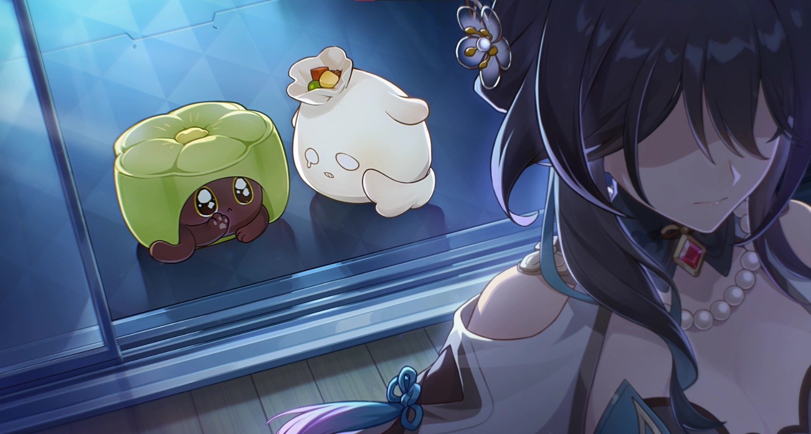
      <figcaption>Ruan Mei's creations yearn for her love.</figcaption>
    </figure>

    It is important to note that while Ruan Mei doesn't understand the emotional connection between her and her creations, it does not mean that she feels absolutely nothing towards them. As much as Ruan Mei dislikes to admit it, she is a human with emotions as well. She just does not have a strong understanding or acceptance of her emotions. 

    When Ruan Mei leaves Herta Space Station to continue with her research, leaving behind her critters, she still asks the Trailblazer about them. She is concerned for their wellbeing, and she even asks for a "family picture" of her critters later on. Ruan Mei acknowledges the existence of prominent critters such as Ashy Paste and Molten Cheese Tart, who wrote a letter of support to her, and she genuinely hopes that the two will get along well.

    <figure markdown>
      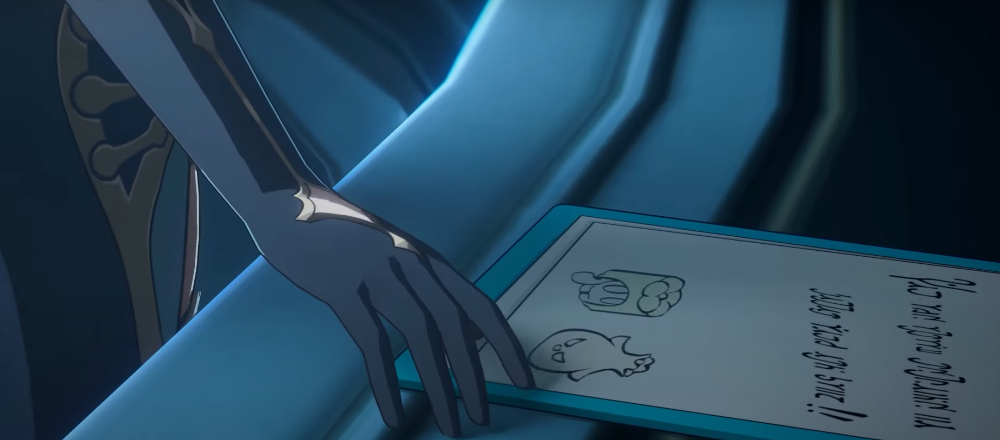
      <figcaption>"Walk your own path, Ruan Mei! We'll always support you!"</figcaption>
    </figure>

    > *"About the progress of my research... I'm not at liberty to state directly. However, you can look at this "puppet." No need to be shocked. It indeed possesses language and emotional capabilities, and can gain various states depending on its mood. If you like, you can keep it. It's not a big deal, just a small experiment. How to take care of it? Do you mean how you can... "nurture" it? Well, that's still a bit complex, but I'll see if I can draft a simplified formula for your purposes."*
    >
    > — Ruan Mei, about her research

    Most of the time, however, Ruan Mei views her creations as simply experiments that need to be studied, and nothing more. If they are a "failed" experiment that does not meet her expectations, she casts them aside. She won't kill them, but she won't know what to do with them. Ruan Mei even offers to give her "experiments" away if she does not need them anymore. This is shown when she leaves behind several critters at the Herta Space Station for the Department of Ecology to take care of. She simply does not care about them afterwards.

    When taking care of her creations, Ruan Mei views it more of a required task rather than an act of care. When giving the Trailblazer one of her creations, which she refers to as a "puppet" with intelligent and emotional capabilities, she states that she can draft a formula to nurture the creature. Instead of instructing the Trailblazer what to do, she instead uses a scientific formula, showing how she views her creation as a mere experiment rather than a companion or pet. How quickly and indifferently she was willing to give it away also illustrates how Ruan Mei does not have a connection with her creations.

=== "Trailblazer"
    > *"Worry not, my dear... 'assistant.' I will definitely 'reward' you."*
    >
    > — Ruan Mei, while viewing the Trailblazer's progress in the Simulated Universe

    The Trailblazer, as the main protagonist of the story, inevitably encounters Ruan Mei in the main story, during the 1.6 Trailblaze Continuance chapter. At this point, the Trailblazer already knows of Ruan Mei, as they have likely encountered her famous occurrence and/or her Simulated Universe avatar beforehand.

    In the main story, Ruan Mei uses the Traiblazer's reputation, trust, and abilities to her advantage. The Trailblazer is easily swayed, to the point of consuming an anti-truth serum given by Ruan Mei, which allows Ruan Mei to easily get the Trailblazer to do her bidding. Of course, while this is definitely behavior that should not be encouraged, Ruan Mei makes sure to reward the Trailblazer. She believes in having an incentive for everything, so she assures that the Trailblazer will sufficiently benefit from helping her and stands by her word.

    <figure markdown>
      
      <figcaption>The Trailblazer meets Ruan Mei in person for the first time.</figcaption>
    </figure>

    The Trailblazer seems to have mixed feelings towards Ruan Mei. On one hand, they seem attracted to her beauty and elegant demeanor. On the other hand, they also don't like how she forced them to fight an Emanator of Propagation without prior warning. It has also become a slight running joke that Ruan Mei will offer the Trailblazer pastries with "weird ingredients" as a reference to the time the Trailblazer unknowingly consumed a pastry with anti-truth serum. In general, though, the Trailblazer's opinion towards Ruan Mei seems fairly neutral or slightly positive, depending on what dialogue options the player chooses. As for Ruan Mei, she merely sees the Trailblazer as a tool for her. However, she will occasionally acknowledge the Trailblazer, whether it be their character, strength, humor, or other qualities.

## Theories
Below are some possible theories about Ruan Mei. Please keep in mind that these theories are not confirmed to be true and are simply inferences based on the currently available material on Ruan Mei. (THESE SECTIONS ARE UNDER CONSTRUCTION)

### Becoming an Aeon
It is no question that Ruan Mei has considered the possibility of becoming an Aeon herself. This face has been made quite obvious in her Myriad Celestia trailer. However, many people don't know the reason for this. 

Ruan Mei's goal isn't necessarily to become an Aeon. Rather, it is a possibility that she is interested in if she ends up uncovering the mysteries and unknowns of Aeons. Theoretically, if Ruan Mei, someone who has created entirely new species, created worlds, and even created dimensions, can understand the biological code of an Aeon, then it is possible to create and even become one. She is already quite close, as she has created a replica of an Emanator already.

The issue is that Aeons are complicated, variable, and not like other lifeforms. In the Star Rail universe, Aeons are something of a godly being, something that differs from normal creatures. They don't follow the same biological rules as other specimen in the universe. Thus, it is difficult to understand what makes an Aeon. How does one ascend to Aeonhood? Can one be born as an Aeon? What defines an Aeon? The answer to these questions defy science and logic, and to Ruan Mei, a biologist, it is something that she finds fascinating. If Ruan Mei can find the answer to these questions and truly understand all there is to Aeons, then not only can she potentially create an Aeon herself, she can even become one.

To summarize, Ruan Mei doesn't necessarily *want* to become an Aeon. She doesn't care about gaining power or ascending to Aeonhood. She simply wants to understand them and test the limits of her understanding, as it is one of the few biological topics she cannot understand. If she truly understands Aeons, then she can create or become one. She has similarly proven her understanding of living beings by creating new species. Funnily enough, Ruan Mei is already disconnected from society and people and has an extreme obsession with something (creation and understanding life), so she is ironically already on track to become an Aeon. 

What Aeon would Ruan Mei be if she ended up becoming one? The most possible ones would be the Aeon of Origin, Aeon of Creation, or Aeon of Life. There is already an Aeon of Finality, so an Aeon of Origin would balance it out according to HooH's equilibrium. An Aeon of Creation would be possible as well, as Ruan Mei is already regarded as a "master of creation." The least likely of the three would be the Aeon of Life, as it is a bit too similar to the Aeon of Abundance. 

### Being a member of the Sanctus Medicus
This theory is quite interesting and has little backing, but it is still something worth considering. The basis for this theory is the Golden Badge that can be obtained via Bailu's Companionship Quest.

{ align=left

### Reviving her Parents
It has been stated already that Ruan Mei's relationship with love and her parents was quite odd. More importantly though, after her parents' deaths, Ruan Mei states that it was a shame that she could not protect her parents, breaking the promise she had made.

## Sources
[^1]: [Myriad Celestia Trailer — "Transcendent Ruan Tunes, Blushing Mei Blooms" | Honkai: Star Rail](https://www.youtube.com/watch?v=zLbGzCuxLy4)
[^2]: [Ruan Mei Trailer — "In All Does Life Flow" | Honkai: Star Rail](https://www.youtube.com/watch?v=xrovyt1awpk)
[^3]: [Ruan Mei Character Story: Part I](https://wiki.hoyolab.com/pc/hsr/entry/1638)
[^4]: [Ruan Mei Character Story: Part II](https://wiki.hoyolab.com/pc/hsr/entry/1638)
[^5]: [Ruan Mei Character Story: Part III](https://wiki.hoyolab.com/pc/hsr/entry/1638)
[^6]: [Ruan Mei Character Story: Part IV](https://wiki.hoyolab.com/pc/hsr/entry/1638)
[^7]: [Trailblaze Mission: When the Stars of Ingenuity Shine](https://honkai-star-rail.fandom.com/wiki/When_the_Stars_of_Ingenuity_Shine)
[^8]: [Curio: The Pinkest Collision](https://honkai-star-rail.fandom.com/wiki/Simulated_Universe/Curio#The_Pinkest_Collision)
