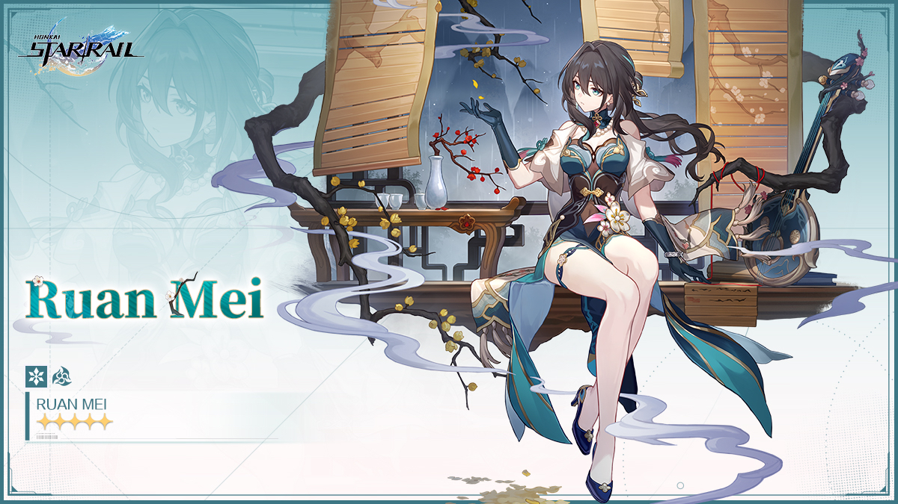
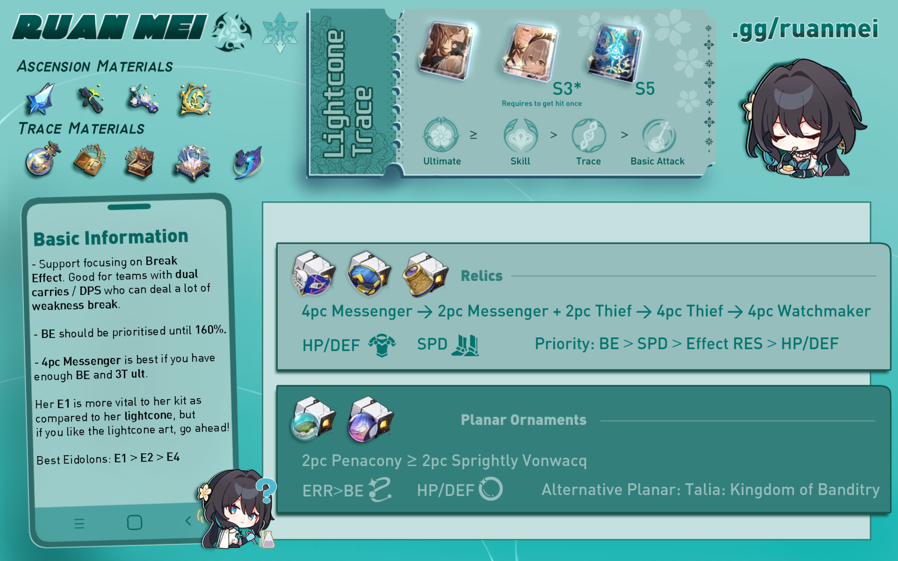
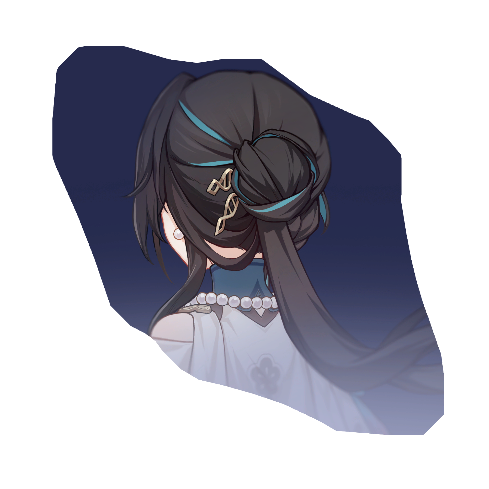
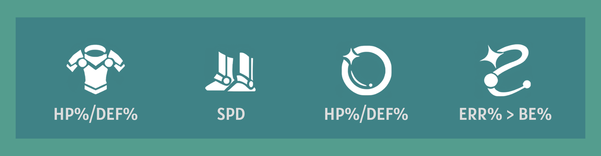
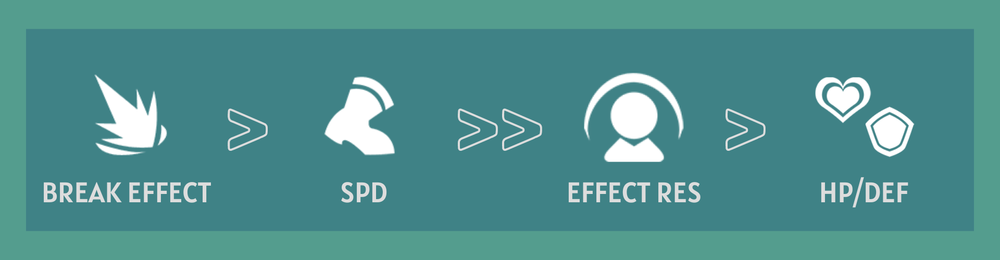

# Ruan Mei Full Guide ❀
##### _Updated for 2.5; Written by mr.swedishfish and sealary, Edited by nv50, m4raku, and euphriia, Calculations provided by agentyoda, m4raku, drachk, sealary, and nv50_
> _"Humans overestimate the infallibility of logic, and in clinging to reason can become slaves to their emotions. Science is born from fanaticism — it is a gift."_

## Guide Updates
??? edit "Patch 2.5 Updates"

    ## Guide Updates (Patch 2.5)
    The following are the newest additions and changes to our guide with the release of patch 2.5.

    ### New Relic Recommendations
    { align=left width=75 } **Iron Cavalry Against the Scourge**, released in 2.3 and intended for Super Break DPS characters like Firefly, while the 4PC passive doesn't benefit Ruan Mei, its 2PC passive is exactly the same as other commonly used relic sets like **Thief of Shooting Meteor** and **Watchmaker, Dream of Machinations**. In other words, this set allows for another source of Break Effect, so you can farm this set for fuel efficiency if you need **The Wind-Soaring Valorous** set for another character! Check out which relic sets you can use on Ruan Mei in our [4PC Relic Set Recommendations](#4pc-relic-recommendations "4PC Relic Set Recommendations") section!

    { align=left width=75 } **Lushaka, the Sunken Seas**, a new planar ornament set released in 2.5, joins **Sprightly Vonwacq** and **Penacony, Land of the Dreams** as another Energy Regeneration Rate set. As Ruan Mei is heavily reliant on ERR due to her Ultimate being highly valuable, this set is already a viable alternative for her. Furthermore, its passive is less restrictive than the Penacony set and can accomodate more team compositions, making it a great option for Ruan Mei. Check out Ruan Mei's other viable planar ornaments in our [2PC Planar Ornament Recommendations](#2pc-planar-ornament-recommendations "2PC Planar Ornament Recommendations") section!

    ### Updated Synergies
    { align=left width=75 } Following the patch 2.4 update, **March 7th (Hunt)** makes her debut with a new path, meant to benefit FUA and break-focused characters. March 7th deals quite a lot of Toughness damage on her own, and her Enhanced Basic Attack can pack a punch. Having Ruan Mei on her team can only benefit March's damage output. Want to learn more about Ruan Mei's best teammates and synergies? Read more about Ruan Mei's best and not-as-great teammates in our [Teammates Section](#teammates "Teammates Section").

    { align=left width=75 } **Lingsha** joins Gallagher as the second sustain character with break mechanics in patch 2.5. Like Gallagher, Lingsha's additional healing also scales off Break Effect and she aims to break enemies faster, both of which Ruan Mei benefits. Ruan Mei is the game's premier break support, so her buffs only directly benefit Lingsha's support and utility capabilities. Whether you need a second Gallagher for your break team, a FUA sustain, or just another sustain in general, make sure to pair her with Ruan Mei if you can!

    **Yunli**, the new Physical Destruction DPS released in patch 2.4, has been added to the list of anti-synergies with Ruan Mei. Because she is a counter-focused character like Clara, Ruan Mei's Weakness Break Extension does not synergize well with Yunli's skills.

??? edit "Patch 2.3 Updates"

    ## Guide Updates (Patch 2.3)
    The following are the newest additions and changes to our guide with the release of patch 2.3.

    ### New Character Comparisons
    { align=left width=75 } Following the patch 2.2 story update, **Harmony Trailblazer** is the newest break-focused Harmony character added to the game. As the protagonist, they are free to obtain and a great budget alternative to Ruan Mei. Their unique Super Break mechanic, which was introduced along with their release, allows for characters who deal high Toughness DMG to deal high amounts of damage! How does the Trailblazer compare to Ruan Mei in break teams? Are they just a "discount Ruan Mei" for those who missed out on Ruan Mei? Or do they provide their own value to the table? Find out by checking out our updated [Character Comparisons](#character-comparisons "Character Comparisons") section!

    { align=left width=75 } **Robin**, Penacony's beloved singer and follower of Xipe, joins the game's roster of outstanding limited 5-star Harmony characters alongside Sparkle and Ruan Mei. Like Ruan Mei and unlike Sparkle, Robin is focused on teamwide buffs, making her a decent competitor to Ruan Mei. While Robin clearly shines the most in FUA teams, she, like the other limited 5-star Harmony characters, is a great option for general use as well. Who is the true queen of Harmony, however? Check out our updated [Character Comparisons](#character-comparisons "Character Comparisons") section to find out!

    ### New Light Cone: Flowing Nightglow
    { align=left width=75 } With Robin's release comes a new 5-star Harmony light cone, **Flowing Nightglow**. While it's obvious it is tailored for Robin, how does this light cone compare to Ruan Mei's other amazing options? Does it compare to Sparkle's or Bronya's light cones? Is it comparable to Ruan Mei's already amazing light cone options such as MotP or Meshing Cogs? Find out by checking out our updated [Light Cone Recommendations](#light-cones "Light Cone Recommendations") for Ruan Mei!

    ### Updated Synergies
    { align=left width=75 } Following the patch 2.1 update, **Gallagher** is introduced as the first sustain character with break mechanics, meant to benefit Nihility characters such as Acheron. His additional healing also scales off Break Effect, which Ruan Mei buffs. As Ruan Mei is the game's premier break support, her buffs only directly benefit Gallagher's support and utility capabilities. Want to learn more about Ruan Mei's best teammates and synergies? Read more about Ruan Mei's best and not-as-great teammates in our [Teammates Section](#teammates "Teammates Section").

    { align=left width=75 } While **Harmony Trailblazer** may be seen as a direct competitor to Ruan Mei, as both characters are focused on buffing break damage characters, HMC actually works incredibly well with Ruan Mei as a teammate! Both characters provide different buffs, meaning there will be no diminishing returns in buffs, yet both effectively support break-DMG DPS characters. Ruan Mei's buffs also directly buffs HMC's Super Break mechanic, as Super Break depends on how much Toughness DMG a character deals and whether the enemy is Weakness Broken or not. In break-focused teams, pairing HMC and Ruan Mei together is a must.

    { align=left width=75 } Following the 2.2 patch update comes the game's first ever limited 5-star break-focused character. **Boothill**, the foul-mouthed and optimistic Galaxy Ranger, can implant Physical Weakness on enemies, allowing him to break enemies more easily. His Pocket Trickshot passive also greatly benefits from Ruan Mei's Weakness Break extension, Weakness Break efficiency increase, and Break Effect increase. This, along with Boothill's enemy action delay, is a great defensive and offensive combination for your team!

    { align=left width=75 } Patch 2.3 features the fan-favorite and long-awaited Stellaron Hunter, **Firefly**, also known as SAM. Ironically (due to their relations to the Swarm Disaster), these two characters work extremely well together. Like Boothill, Firefly can implant Fire Weakness on enemies, allowing her to break enemies more easily. Furthermore, Firefly can reduce the Toughness of enemies without Fire Weakness on her ultimate. Due to Firefly's damage being reliant on Super Break, Firefly greatly benefits from Ruan Mei's Weakness Break extension, Weakness Break efficiency increase, and Break Effect increase. As Firefly's first banner is running alongside Ruan Mei's rerun, it is necessary to try to obtain both characters if you plan to pull for Firefly. Ruan Mei is a must-have for this Stellaron Hunter!

??? edit "Patch 2.0 Updates"

    ## Guide Updates (Patch 2.0)
    The following are the newest additions and changes to our guide with the release of patch 2.0.

    ### New Relic Set: Watchmaker, Master of Dream Machinations
    { align=left width=75 } This new relic set not only increases Break Effect for Ruan Mei by a hefty amount, it also increases Break Effect for the entire team. Due to this new Break Effect-focused relic set, many may wonder if making the switch to this set is necessary for Ruan Mei. Find out what set is right for you by checking out our updated [4PC Relic Set Recommendations](#4pc-relic-recommendations "4PC Relic Set Recommendations") for Ruan Mei!

    ### New Light Cone: Earthly Escapade
    { align=left width=75 } With the release of Sparkle, the newest and second limited Harmony character, comes a new 5-star light cone, **Earthly Escapade**. How does this light cone compare to other existing options? Is it better than Bronya's light cone? Maybe even Meshing Cogs? Is it worth pulling if you've missed Ruan Mei's last light cone banner? Or is it just something that only Sparkle can benefit from? Find out by checking out our updated [Light Cone Recommendations](#light-cones "Light Cone Recommendations") for Ruan Mei!

    ### Updated Synergy and Anti-Synergies
    { align=left width=75 } **Misha** joins the growing number of Ice DPS characters following the patch 2.0 update. Because of the Penacony, Land of Dreams relic set, which encourages the usage of Ice DPS characters with Ruan Mei, and his rarity, Misha is a potential budget option to use with Ruan Mei. His ultimate, which freezes enemies, pairs well with Ruan Mei's Weakness Break extension, causing enemy actions to be further delayed. With Misha's freeze and Ruan Mei's delay, enemies won't even have a chance to act! Read more about Ruan Mei's best and not-as-great teammates in our [Teammates Section](#teammates "Teammates Section").

    **Seele** has been added to the list of anti-synergies with Ruan Mei due to the fact that Ruan Mei can "steal" Seele's kills, preventing her from triggering her Resurgence passive. However, Ruan Mei is still a top pick for Seele due to her universal buffs.

## Introduction
Ruan Mei is a 5-star Ice Harmony character and Member #81 of the Genius Society. As the first-ever limited 5-star Harmony character, Ruan Mei faces high expectations. These expectations especially concern her performance in relation to other high-value Harmony characters, such as Tingyun, Bronya, and Asta, as well as her overall utility and usage. Does she hold a candle to them, or is she outshined by their incredible support value? Read this guide to learn how to optimize Ruan Mei effectively, find out her best builds, and see how she can fit into your teams!

## Ruan Mei TLDR
Ruan Mei is a support character capable of increasing allies' Weakness Break Efficiency, SPD, and All-Type RES PEN(1). At the same time, Ruan Mei can also deal additional Break DMG whenever allies Weakness Break an enemy, causing the Weakness Broken enemies' actions to be further delayed.
{ .annotate }

1.  RES PEN is short for **resistance penetration**. What is RES PEN and how does it work? Check out the [Trace Overview](#trace-overview "Ruan Mei Trace Overview") section and read more about it in her Ultimate description!

*[RES PEN]: Resistance Penetration
*[SP]: Skill Point
*[3T ult]: 3-Turn Ultimate
*[4T ult]: 4-Turn Ultimate
*[MotP]: Memories of the Past
*[PSiM]: Past Self in Mirror
*[HMC]: Harmony Trailblazer
*[FUA]: Follow-up Attack
*[BiS]: Best in Slot
*[EBA]: Enhanced Basic Attack
*[DoT]: Damage Over Time
*[ERR]: Energy Regeneration Rate

If you need a quick overview on Ruan Mei and how to build her, you can check the infographic below or check our [Quick Guide](quick.md "Ruan Mei Quick Guide").

<figure markdown>
  
  <figcaption>Infographic designed by littlemari</figcaption>
</figure>

## Pros and Cons
Why should you use and build Ruan Mei? Should you pull for Ruan Mei over other units? While she is admittedly high-cost for the average player as a limited 5-star character, she still provides a lot of utility as a strong support character. She certainly lives up to the daunting title of the first limited Harmony character, especially shining with her All-Type RES PEN, full-team buffs, and the fact that she's SP positive(1). However, she is not an absolute must-pull, so ultimately the choice is yours to make based on your own personal needs and opinions.
{ .annotate }

1.  SP positive, or **skill point positive**, refers to when a character generates more skill points than uses them. Ruan Mei is considered SP positive because her skill, which uses one skill point, lasts for three turns. This means that two out of three of her turns will be basic attacks, generating a net positive amount of skill points for her team.

=== "PROS"
    { align=left }

    - Ruan Mei's ultimate provides All-Type RES PEN, which is very valuable
    - Ruan Mei functions as a highly flexible team-wide support character
    - As a universal buffer, Ruan Mei will likely remain a strong character even in the future
    - Ruan Mei is SP positive
    - Ruan Mei is super pretty!

=== "CONS"
    { align=left }

    - Ruan Mei is a limited 5-star character, so she's not as easily accessible as other characters
    - Ruan Mei doesn't replace existing Harmony characters who are already considered very good
    - Ruan Mei is not a "must pull" for your account

## Playstyle Strategy
Because Ruan Mei is SP positive and her skill lasts for three turns, it is recommended to follow a Skill > Basic > Basic playstyle. Her skill should generally be used before your DPS characters take action so that your DPS can be buffed. With Ruan Mei's technique, 2pc Vonwacq, or enough SPD, this can easily be achieved. Her technique also saves one skill point at the start of battle, allowing even easier access.

Ideally, you want to cast Ruan Mei's ultimate every three turns (this will be referred to as 3T ult). This is so you can have as much ultimate uptime as possible. Ruan Mei's value mostly comes from her ultimate, so higher uptime means more buffs. The problem is that this is pretty difficult to achieve. Her signature light cone does not provide enough energy to achieve a 3T ult, and Energy Recharge buffs and stats are extremely rare.

<iframe src="https://streamable.com/e/run3ah?autoplay=1" frameborder="0" width="100%" height="100%" allowfullscreen allow="autoplay" style="width:100%;height:100%;position:absolute;left:0px;top:0px;overflow:hidden;"></iframe>

<figure markdown>
  <figcaption>Example of a 3T ultimate with S4 MotP by sealary.</figcaption>
</figure>

Is 3T ult really necessary, though? Not really, but it is ideal. It is more important to reach the minimum recommended Break Effect (180%) before focusing on a 3T ult. If you're comfortable with casting Ruan Mei's ultimate every four turns instead, then that's fine! While you may lose out on some buffs, Ruan Mei certainly isn't "unplayable" with a 4T ult. Again, it is more important to focus on having at least 180% Break Effect. 

Still, it is best to try to optimize your ultimate uptime as much as possible. Even if you can't achieve a 3T ult, you should still try to make the most of your energy and ult as much as you can with what you have. It is best to aim for 4T ult as a minimum goal and 3T as the ideal.

If you are unsure if you are able to achieve a 3T or 4T ultimate with what you have, you can check our [Energy Requirements](#energy-requirements "Ruan Mei Energy requirements") section in this guide!

<iframe src="https://streamable.com/e/fgk1sw?autoplay=1" frameborder="0" width="100%" height="100%" allowfullscreen allow="autoplay" style="width:100%;height:100%;position:absolute;left:0px;top:0px;overflow:hidden;"></iframe>

<figure markdown>
  <figcaption>Example of a 4T ultimate with S2 Dance! Dance! Dance! by sealary.</figcaption>
</figure>

## Traces
Ruan Mei's traces are mainly focused on buffing her allies, specifically around break mechanics. She relies on a high amount of break effect, and she buffs Break Effect and Weakness Break Efficiency for her allies.

### Trace Priority

Ruan Mei's value comes from her ultimate and her skill. As a Harmony character, she focuses on buffing her allies rather than dealing high amounts of damage. Her ultimate and skill boost her allies' damage, her ultimate increases the RES PEN(1) of her allies, and her skill increases the overall damage and Weakness Break Efficiency of her allies. This causes these two traces to be her most valued traces and the ones that should receive the most priority.
{ .annotate }

1.  RES PEN is short for **resistance penetration**. What is RES PEN and how does it work? Check out the Trace Overview below and read more about it in her Ultimate description!

Ruan Mei's ascension traces are also quite decent. Her second and fourth ascension traces are very useful in improving her support capabilities, and they should definitely be activated.

### Trace Overview

=== "Basic ATK: Threading Fragrance"

    #### Basic ATK: Threading Fragrance

    Deals a minor amount of Ruan Mei’s ATK as ICE DMG to a single enemy. Generates 20 Energy for Ruan Mei. 

    

    This trace should be the least prioritized, as it deals very minimal damage. Furthermore, Ruan Mei relies on break effect stats rather than CRIT stats, so this trace will not be very useful.

=== "Skill: String Sings Slow Swirls"

    #### Skill: String Sings Slow Swirls

    Ruan Mei gains Overtone, lasting for 3 turns and decreases in 1 usage at the start of her turn. While Overtone is active, all allies’ DMG increases and Weakness Break Efficiency increases by 50%. Generates 30 Energy for Ruan Mei. 

    

    This is one of Ruan Mei's most valuable traces. However, as mentioned above, Ruan Mei is SP positive, meaning that she will use a Skill > Basic > Basic playstyle. In turn, this means that her skill does not need to be prioritized over her ultimate, which is her most important trace. Furthermore, as Ruan Mei's passives already buff her allies' DMG, leveling up her skill will lead to diminishing returns. Despite this, you'll still want to level this trace as much as possible eventually. First prioritize her ultimate, and then prioritize this trace.

=== "Ultimate: Petals to Stream, Repose in Dream"

    #### Ultimate: Petals to Stream, Repose in Dream

    Ruan Mei deploys a field that lasts for 2 turns. The field's duration decreases by 1 at the start of her turn.
    
    While inside the field, all allies' All-Type RES PEN increases and their attacks apply Thanatoplum Rebloom to the enemies hit.

    When these enemies attempt to recover from Weakness Break, Thanatoplum Rebloom is triggered, extending the duration of their Weakness Break, delaying their action by an amount equal to a portion of Ruan Mei's Break Effect plus 10%, and dealing Break DMG equal to a portion of Ruan Mei's Ice Break DMG.

    Enemy targets cannot have Thanatoplum Rebloom re-applied to them until they recover from Weakness Break.

    

    It is **highly recommended** to level Ruan Mei's ultimate. This is her bread and butter, and it is what makes her very valuable to your team. The reason why this trace should be highly prioritized is due to the All-Type RES PEN that it provides, making Ruan Mei a universal shredder.

    ??? tip "What is RES PEN and how does it work?"
    
        RES PEN, short for Resistance Penetration, refers to when the character ignores the enemy's resistance. This is an incredibly useful stat, as enemy resistance affects the damage it takes quite significantly. With RES PEN, your damage output increases greatly, especially against enemies with high resistance.

        For example, if an enemy has 0% Ice RES, they will take 100% of the Ice DMG inflicted on them. With 25% RES PEN, the enemy will now take 125% of the Ice DMG received. This means that your damage will increase by 25%.

        If an enemy has 60% Ice RES, they will only take 40% of the Ice DMG inflicted on them. Without RES PEN, you will lose out on a lot of damage due to the enemy's resistance. With 25% RES PEN, however, the enemy's Ice RES drops from 60% to 35%. This means that the Ice DMG it receives is now 65% instead of 40%. While this doesn't look all that impressive, the DMG dealt has increased by 62.5%, which is quite a lot!
   
        In conclusion, RES PEN is incredibly valuable. Ruan Mei provides All-Type RES PEN, meaning that she is able to decrease all types of enemy resistance, making her a flexible and strong support.

=== "Talent: Somatotypical Helix"

    #### Talent: Somatotypical Helix

    { align=left } Increases SPD for the team (excluding Ruan Mei). When allies Break an enemy target's Weakness, Ruan Mei deals to this enemy target Break DMG equal to a portion of her Ice Break DMG.

    This trace is nice to have, giving allies a free SPD boost. However, it does not increase SPD by very much, and it should not be relied on for SPD tuning, so it shouldn't be prioritized over others.

=== "A2: Candle Lights on Still Waters"

    #### A2: Candle Lights on Still Waters

    { align=left } In battle, for every 10% of Ruan Mei's Break Effect that exceeds 120%, her Skill additionally increases allies' DMG by 6%, up to a maximum of 36%.

    This trace should definitely be prioritized. When Ruan Mei's Break Effect reaches 180% or higher, her allies will recieve a free 36% DMG increase from her skill. This is also why having at least 180% Break Effect is recommended.

=== "A4: Days Wane, Thoughts Wax"

    #### A4: Days Wane, Thoughts Wax

    { align=left } Ruan Mei regenerates 5 Energy at the start of her turn.

    This trace should be prioritized. Because Ruan Mei's ultimate is important, she needs as much energy as she can get. This trace also makes 3T ult possible and helps with Ruan Mei's energy management.

=== "A6: Inert Respiration"

    #### A6: Inert Respiration

    { align=left } Increases Break Effect by 20% for all allies.

    This trace is decent, but it's not as valuable as the other ascension stats. Still, it is recommended to prioritize this trace. It helps make reaching the recommended 180% Break Effect threshold easier, allowing you to invest in other stats, and it benefits any allies who need Break Effect. **NOTE: THIS TRACE DOES NOT TAKE EFFECT UNTIL YOU ARE IN BATTLE.**

## Eidolons

Most players won't be pulling for eidolons, especially because Ruan Mei's base kit is already amazing, but in case you are someone who wants to know which eidolon is the best, we have you covered. If you manage to get lucky or have some extra funds, it is recommended to pull for Ruan Mei's E1. Her first eidolon is extremely powerful and offers a free DEF shred. **Between E1 and signature LC, definitely pull for Ruan Mei's E1.** 

### Eidolon Overview

=== "E1: Neuronic Embroidery"
    
    { align=left width=200 }

    While the Ultimate's field is deployed, the DMG dealt by all allies ignores 20% of the target's DEF.

    * Ruan Mei's best eidolon
    * Between E1 and LC, prioritize E1
    * Offers unconditional DEF shred (think 4PC Genius set)

=== "E2: Reedside Promenade"

    { align=left width=200 }

    With Ruan Mei on the field, all allies increase their ATK by 40% when dealing damage to enemies with Weakness Break.

    * Mediocre eidolon
    * Generic team-wide DMG increase
    * Allows for allies to use SPD boots

=== "E3: Viridescent Pirouette"

    { align=left width=200 }

    Ultimate Lv. +2, up to a maximum of Lv. 15. Talent Lv. +2, up to a maximum of Lv. 15.

    * Generally good eidolon
    * Levels up talent and ultimate, which is quite valuable
    * Not necessary for Ruan Mei

=== "E4: Chatoyant Éclat"

    { align=left width=200 }

    When an enemy target's Weakness is Broken, Ruan Mei's Break Effect increases by 100% for 3 turn(s).

    * Mediocre eidolon
    * Allows for stat redistribution
    * General increase in personal DMG

=== "E5: Languid Barrette"

    { align=left width=200 }

    Skill Lv. +2, up to a maximum of Lv. 15. Basic ATK Lv. +1, up to a maximum of Lv. 10.

    * Underwhelming eidolon
    * Ruan Mei's Basic ATK should be least prioritized
    * Only get E5 if you plan to get E6

=== "E6: Sash Cascade"

    { align=left width=200 }

    Extends the duration of the Ultimate's field by 1 turn(s). The Talent's Break DMG multiplier additionally increases by 200%.

    * Ruan Mei's second best eidolon
    * Higher ultimate uptime, which is very valuable
    * Significant increase in Ruan Mei's personal DMG

## Light Cones

Ruan Mei's light cone situation is quite interesting. Her signature light cone, while it is quite good due to the raw stats it offers, does not provide enough energy to achieve 3T ult. This makes other budget-friendly options a viable choice for Ruan Mei, and some can even compare to or outperform Ruan Mei's signature light cone. We won't deny that Ruan Mei's light cone is extremely beautiful, though. If you are unsure of which light cone works best for your energy needs, check out our [Energy Requirements](#energy-requirements "Ruan Mei Energy Requirements") section.

### Light Cone Recommendations

| Light Cone  |Notes                                |
| ----------- |------------------------------------ |
| |  **Past Self in Mirror** is Ruan Mei's signature and best in slot light cone. While it doesn't provide a lot of energy to ensure a 3T ultimate, you only need to be hit once or twice to achieve a 3T ult. The other benefits it provides, including high SP positivity, are quite powerful as well, allowing it to slightly edge out S5 MotP. It greatly reduces the need for Break Effect, allowing you to invest in other stats. Ironically, **this light cone performs much better on HMC than on Ruan Mei**. If you are deciding whether to pull for E1 or S1, **pull for E1**.|
|      | **Memories of the Past** is Ruan Mei's best 4-star light cone and a great budget alternative to PSiM. It provides Ruan Mei's most needed stats, Break Effect and energy. At **S3+**, Ruan Mei only needs to be hit once to ensure a 3T ultimate. At **S5**, it competes with PSiM because it guarantees a 3T ultimate. If you already have S5 MotP, it is generally not recommended to pull for PSiM because the difference between the two light cones is marginal. The only exceptions to this is if you plan to use HMC with Ruan Mei and don't have two S5 MotPs on hand. |
|   | **Meshing Cogs**, a popular budget light cone choice for Harmony characters due to the energy it provides, is a very viable option for Ruan Mei. Because it is a 3-star light cone, it is easily accessible for F2P players. At **S5**, this light cone outperforms S2 MotP due to the energy it provides. However, because it does not provide Break Effect, it generally performs worse than PSiM and S5 MotP. Still, if the minimum Break Effect can be achieved, this light cone is a very strong option for Ruan Mei. |
|  | **Earthly Escapade** is Sparkle's signature light cone. While it doesn't provide any energy, which also means its crit buff passive only has about 50% uptime, the buffs it provides still prove useful. However, because it does not provide any of Ruan Mei's needed stats, it is a much more viable option for Sparkle, as it is tailor-made for her.
|  | **Flowing Nightglow** is Robin's signature light cone. This lightcone may be a great source of energy, especially if your team consists of characters who attack a lot. It can also provide a decent damage boost. However, the damage boost has only about a 33% uptime, and Ruan Mei doesn't make use of the attack buff. Thus, this light cone is a much more viable option for Robin, as it is tailor-made for her.
|  | **Dance! Dance! Dance!** is a possible option due to its basic utility, which advances forward all allies upon casting the wearer's ultimate. However, because it does not provide any of Ruan Mei's needed stats, it is not recommended over the above options.
|  |**Planetary Rendezvous** is an option for Ruan Mei if you are using her in Ice teams. However, Ruan Mei already provides DMG buffs for her allies, and having more leads to diminishing returns. Furthermore, this light cone does not provide Break Effect or Energy, Ruan Mei's most needed stats.
|  | **But the Battle Isn't Over**, Bronya's signature light cone, is generally NOT recommended unless at high superimpositions. The only part of it that benefits Ruan Mei is the energy it provides, but it is not enough to justify using it over the above options.

### Light Cone Distribution with Harmony Trailblazer

Because HMC makes better use of Ruan Mei's signature light cone than Ruan Mei does and benefits more from Break Effect rather than ERR, it is recommended to give HMC the light cone that provides more Break Effect. Below is a chart that shows who should use which light cone based on your light cone availability.

<chart TBD>

## Relic Sets

Ruan Mei mainly needs Break Effect, SPD, and Energy Regeneration Rate, as those are the stats that help improve her support capabilities the most. Because she is a support character and Break DMG cannot crit, offensive stats such as CRIT and ATK don't contribute anything to her playstyle. Do not invest in those.

When choosing a relic set for Ruan Mei, prioritize reaching 180% Break Effect (160% without Ruan Mei's Inert Respiration trace) first. If you are lacking Break Effect, it may be better to run a relic set that provides more Break Effect, depending on what you need. If you are able to cast Ruan Mei's ultimate often and reach the required amount of Break Effect without a Break Effect relic set, then 4PC Hackerspace is recommended. Otherwise, consider using a 2PC 2PC alternative or even a different set.

For 2PC 2PC combinations, it is recommended to run a 2PC Break Effect set with 2PC Hackerspace. When choosing which Break Effect set to farm, choose the set that is more fuel-efficient. If you need the Pioneer (debuff) set, farm for Watchmaker. If you need the Boxing (physical) set, farm for Thief. If you need the Valorous (FUA) set, farm for Iron Cavalry.

### 4PC Relic Recommendations

=== "4PC Messenger Traversing Hackerspace"
    { align=left }
    
    Increases SPD by 6%. When the wearer uses their Ultimate on an ally, SPD for all allies increases by 12% for 1 turn.

    * Increases personal SPD
    * Increases SPD for all allies (about 25%-33% uptime)
    * Only recommended if you have enough Break Effect, SPD, and ultimate uptime

=== "2PC Thief/Watchmaker/Iron Cavalry, 2PC Hackerspace"
    { align=left width=128 }
    
    Increases the wearer's Break Effect by 16%. Increases SPD by 6%.

    * Increases Break Effect
    * Increases SPD
    * Recommended if you need a balance of additional SPD and Break Effect

=== "4PC Thief of Shooting Meteor"
    { align=left }
    
    Increases the wearer's Break Effect by 32%. When the wearer inflicts Weakness Break on an enemy, regenerates 3 Energy.
    
    * Greatly increases Break Effect
    * Regenerates energy for Ruan Mei if she breaks the enemy
    * Recommended if you are lacking Break Effect and/or ultimate uptime

=== "4PC Watchmaker, Master of Dream Machinations"
    { align=left }

    Increases the wearer's Break Effect by 16%. Increases Break Effect of all allies (including the wearer) by 30% for 2 turns upon using Ultimate.

    * Greatly increases Break Effect
    * Increases Break Effect for all allies (about 50%-66% uptime)
    * Only recommended if you are using a break-focused DPS and if no other ally is using this set

### 2PC Planar Ornament Recommendations

=== "Sprightly Vonwacq"
    { align=left }

    Increases the wearer's Energy Regeneration Rate by 5%. When the wearer's SPD reaches 120 or higher, the wearer's action is Advanced Forward by 40% immediately upon entering battle.

    * Increases Energy Regeneration Rate
    * Allows for higher ultimate uptime
    * Advances forward at the start of battle
    * If Ruan Mei's technique is used, saves 1 skill point

=== "Lushaka, the Sunken Seas"
    { align=left width=128 }

    Increases wearer's Energy Regeneration Rate by 5%. If the wearer is not the first character in the team lineup, then increases the ATK of the first character in the team lineup by 12%.

    * Increases Energy Regeneration Rate
    * Allows for higher ultimate uptime
    * Increases ATK% of the leftmost ally
    * Recommended for teams that make use of ATK%, like DoT teams

=== "Penacony, Land of the Dreams"
    { align=left }
    
    Increases wearer's Energy Regeneration Rate by 5%. Increases DMG by 10% for all other allies that are of the same Type as the wearer.

    * Increases Energy Regeneration Rate
    * Allows for higher ultimate uptime
    * Increases DMG% for matching-type teammates
    * Recommended if running with an Ice DPS

=== "Talia: Kingdom of Banditry"
    { align=left }

    Increases the wearer's Break Effect by 16%. When the wearer's SPD reaches 145 or higher, the wearer's Break Effect increases by an extra 20%.

    * Increases Break Effect
    * Does not provide energy, so ultimate uptime will be lower
    * Recommended if using Meshing Cogs

=== "Broken Keel"
    { align=left }

    Increases the wearer's Effect RES by 10%. When the wearer's Effect RES is at 30% or higher, all allies' CRIT DMG increases by 10%.

    * Increases allies' CRIT DMG
    * Ruan Mei does not really need Effect RES compared to other stats

Many players may believe that 4PC Watchmaker, the new break-focused relic set released in patch 2.0, is Ruan Mei's new BiS set. However, for general usage, Ruan Mei's other relic set options such as 4PC Messenger Traversing Hackerspace, 2PC Break Effect 2PC Messenger, and 4PC Thief of Shooting Meteor are better options. 

4PC Watchmaker is definitely viable for Ruan Mei, but its 4PC passive is only useful in teams with a break-focused DPS, such as Xueyi, Sushang, Firefly, and Boothill. Otherwise, the extra Break Effect is not all that needed. Furthermore, the passive only has about a 50%-60% uptime due to Ruan Mei's ultimate duration. In teams with break-focused DPS characters, though, especially if Ruan Mei is not short on her needed stats, 4PC Watchmaker is definitely a good option to use. However, keep in mind that the 4PC effect does not stack, meaning if you are pairing Ruan Mei with HMC, it is best to choose a different set.

### Relic Stats

As mentioned before, Ruan Mei is a support character who is focused on buffing her allies. She is not meant to deal high amounts of damage. This means that it is better to focus on stats that will improve Ruan Mei's support capabilities. Defensive stats as well as supportive stats like SPD are appreciated, and as Ruan Mei scales off Break Effect, you will obviously need some Break Effect on your relics. It is very important to reach the recommended 180% (160% without Ruan Mei's Inert Respiration trace) Break Effect.

For Ruan Mei's chest piece and planar sphere, choose whichever relic has better substats. HP and DEF are both equally needed for Ruan Mei. For her link rope, it is better to use an ERR rope, as Ruan Mei requires a lot of energy to optimize her ultimate uptime. However, if you are lacking Break Effect, or if you don't have an ERR rope, using a BE rope for the time being is fine. Using an ERR rope eventually is crucial, however.

### Relic Substat Priority

Break Effect should be the most prioritized relic substat, as most of Ruan Mei's kit revolves around Break Effect. Ruan Mei needs at least **180%** Break Effect in total in order to maximize her passive. **Ruan Mei's Inert Respiration trace does not take effect until you are in battle**, so technically, you only need **160%** Break Effect. However, for the sake of consistency, the minimum will be referred as 180%. More Break Effect is generally always better as long as you're not sacrificing other stats.

SPD should also be prioritized, as it allows Ruan Mei to have more turns per cycle, which allows for more SP generation. At least **143** SPD is recommended. Ruan Mei has a total of 134 SPD from her traces and SPD boots, so 143 SPD can be obtainable with a few substat rolls and/or 2PC Messenger Traversing Hackerspace. Like Break Effect, more SPD is better as long as you are not sacrificing other stats. Some players may opt for a slower Ruan Mei build for rare scenarios like 0 cycle runs, but in general, more SPD is better.

Defensive stats such as Effect RES, HP, and DEF are also helpful for Ruan Mei. In combat, she wants to get hit a couple times in order to gain energy, meaning survivability is important to her. With some defensive stats, Ruan Mei's survivability will naturally increase. However, keep in mind that Break Effect and SPD should be prioritized over these stats.

### Energy Requirements

Ruan Mei requires as much energy as she can, as her ultimate is extremely valuable for her team. As mentioned before, it is ideal to cast a 3T ultimate for as much uptime as possible. However, 3T ultimate is difficult to achieve, so a 4T ultimate is fine as well if you are lacking in Break Effect. Below are some energy and light cone combinations to determine if you can achieve a 3T or 4T ultimate with Ruan Mei.

A special case is if you have Huohuo on your team. Huohuo will lower your rotation by one turn.

Note that to achieve 124.4% ER, you must use an ERR rope and Penacony/Vonwacq. To achieve 119.4% ER, you must use an ERR rope. To achieve 105% ER, you must use Penacony/Vonwacq.

| Total Energy | Light Cone | Turns to Cast Ultimate | Notes
|--------------|------------|------------------------|-------
| 124.4% | S1 PSiM | **4** | With this build, you may need to be hit once or twice to achieve 3T ult. This build is **highly recommended** because it allows you to focus on Energy Regeneration, and it is the most SP positive among the ones listed here.
| 119.4% | S1 PSiM | **4** | With this build, you may need to be hit once or twice to achieve 3T ult. It is not recommended to use this build unless you cannot reach 180% Break Effect.
| 124.4% | S5 MotP | **3** | This build is **highly recommended**, as you can comfortably 3T ult with this build without losing out on the necessary Break Effect.
| 119.4% | S5 MotP | **4** | With this build, you may need to be hit once or twice to achieve 3T ult.
| 124.4% | S3 MotP | **4** | With this build, **you will only need to be hit once to achieve 3T ult**.
| 119.4% | S3 MotP | **4** | With this build, you may need to be hit once or twice to achieve 3T ult.
| 124.4% | S5 Meshing Cogs | **3** | While this build achieves 3T ult, you may be lacking in Break Effect. If you have less than **170%** Break Effect with this build, use Talia/BE rope instead.
| 119.4% | S5 Meshing Cogs | **4** | If you are lacking in Break Effect, it is recommended to use this build. You will be able to have more Break Effect, and **you will only need to be hit once to achieve 3T ult**.
| 100% | S5 Meshing Cogs | **4** | You can use this build if you are severely lacking in Break Effect. However, if you are able to reach the minimum 180% Break Effect without Talia/BE rope, use Penacony/Vonwacq/ERR rope instead.
| 124.4% | Other | **4** | This build will comfortably put you at 4T ult, but you may be lacking in Break Effect.
| 119.4% | Other | **4** | This build will comfortably put you at 4T ult, and with 2PC Talia, it will help you reach the necessary Break Effect.
| 105% | Other |**4-5** | This rotation is inconsistent and is generally not recommended.

## Teammates

Due to her universal buffs, such as SPD increase, DMG% increase, and All-Type RES PEN decrease on enemies, Ruan Mei can fit in most teams and can effectively support most DPS characters. If you're wondering if Ruan Mei can work well with your main DPS, the answer is yes if they're not Clara. Even characters who don't benefit as much from Break Effect still benefit form Ruan Mei due to her strong buffs. Below are some characters who work particularly well with Ruan Mei.

### Notable Synergies

| Character   | Notes                            |
| ----------- | -------------------------------- |
|  | **Asta** is a great budget option to use with Ruan Mei. She naturally has incredible toughness damage, so she can break very often, which goes well with Ruan Mei's kit. Fire characters also have a high break multiplier, so a higher break effect allows for more break damage. Furthermore, both Asta and Ruan Mei buff speed, so you will be able to have several turns before the enemy does. Another great thing about Asta is that she buffs ATK% while Ruan Mei buffs DMG%, which allows for less diminishing returns.
|  | **Silver Wolf** is a teammate who will pair well with Ruan Mei. Her main gimmick revolves around weakness implant, and Ruan Mei is focused around teams who will break the enemy. Silver Wolf guarantees that your team will be able to break the enemy and use Ruan Mei to her full potential. Also, Silver Wolf's DEF shred is valuable, and she deals a decent amount of toughness break damage herself. She especially shines with Ruan Mei when using a break effect-focused build.
|  | **Xueyi** gains a DMG boost based on her Break Effect, a stat that Ruan Mei increases for her allies. Furthermore, Xueyi's ultimate deals Toughness DMG regardless of their weakness element, which allows for easier breaking of the enemy. Xueyi is also a 4-star character, making her more accessible for F2P players.
|  | **Sushang** benefits from Break Effect, and she benefits greatly from enemies being weakness broken, making her a great option to go with Ruan Mei. Additionally, Sushang has high Weakness Break Efficiency, which allows her to break often. Physical characters also have a high break multiplier, so a higher break effect allows for more break damage. Furthermore, Sushang is a 4-star character, which means she is more accessible for F2P players.
|  | **Kafka** works extremely well with Ruan Mei. This is because Ruan Mei's buffs, such as RES PEN and DMG%, affect DoT, and DoT still occurs while enemies are weakness broken. Furthermore, breaking enemies also triggers DoT, and Ruan Mei allows her allies to break more often.
|  | **Welt** deals 20% more DMG to enemies inflicted with Weakness Break, making him a great option to pair with Ruan Mei. He also slows enemies, which is a great utility to have and one that synergizes quite well with Ruan Mei. Ruan Mei's Weakness Break and SPD buffs paired with Welt's Slow debuffs make a great team.
|  | **Misha** is a new 4-star Ice DPS character for patch 2.0. He benefits from the Penacony, Land of Dreams relic set on Ruan Mei as an Ice DMG dealer. Furthermore, due to his rarity, he is considered a budget option who is more accessible for F2P players. While he doesn't exactly benefit from Ruan Mei's Break Effect buffs, his ultimate, which can freeze enemies, can help further delay enemy actions.
|  | **Gallagher** was introduced as the first break-focused Abundance character for patch 2.1. His kit allows enemies to receive more break DMG, and allies receive additional healing based on his Break Effect. With Ruan Mei on the team, who increases Break Effect and Weakness Break Efficiency, Gallagher's support capabilities are enhanced.
|  | **Harmony Trailblazer** is a new free Harmony character for patch 2.2, as part of the Trailblazer's newest path switch. They work hand in hand with Ruan Mei as a powerful support duo for break-focused DPS characters. Ruan Mei's Weakness Break efficiency buff, Weakness Break extension, and Break Effect boost pairs especially well with HMC's Toughness Reduction buff, Break Effect boost, and Super Break. Their buffs don't have much overlap, which means they don't suffer from diminishing returns. When using a break-focused DPS character, using both HMC and Ruan Mei is a must.
|  | **Boothill** is the first limited 5-star character who is focused on break mechanics, released in patch 2.2. His Pocket Trickshot benefits from enemies being Weakness Broken, and Boothill deals additional damage based on his Toughness damage, meaning that Ruan Mei is a great teammate for him. Boothill also implants Physical Weakness during his ultimate, allowing him to make better use of Ruan Mei's break-focused buffs. Physical characters also have a high break multiplier, so a higher break effect allows for more break damage.
|  | **Firefly** is the second break-focused limited 5-star character, releasing in patch 2.3 alongside Ruan Mei's first rerun. Her damage is reliant on Break and Super Break mechanics, and she also can implant Fire Weakness and reduce the Toughness of enemies without Fire Weakness. As Firefly greatly benefits from enemies being Weakness Broken, Ruan Mei's Weakness Break efficiency buffs, Weakness Break extension, and Break Effect boost are very much needed buffs for Firefly. While these two characters may not get along lore-wise, they are inseparable teammates in combat!
|  | **March 7th (Hunt)** makes her path switch debut in patch 2.4. In her new swordswoman-in-training form, she takes on the role as a sub-DPS whose main source of damage comes from her Enhanced Basic Attack. March 7th can be built as either a crit-focused or break-focused sub-DPS, as she can deal high amounts of Toughness damage (even being able to reduce Toughness bars that have the same weakness as her Shifu) as well as raw damage from her EBA. With Ruan Mei on her team (not as her Shifu, though!), March's damage output and Toughness reduction capabilities are greatly enhanced.
|  | **Lingsha** is the second break-focused healer, released in patch 2.5. As a Fire Abundance character who is focused on break mechanics, Lingsha will often draw comparisons to Gallagher. However, she has her own unique mechanics as well, such as FUA, frequent teamwide cleanse, and decent sub-DPS damage. She also allows for more Break DMG upon using her ultimate, which pairs well with Ruan Mei. As a character who benefits from Break Effect and deals decent Toughness damage on her own, Lingsha makes great use of Ruan Mei's buffs and is a great addition to Super Break teams. Outside of break teams, Lingsha can also act as an alternative to Aventurine due to her being a FUA sustain.

### Notable Anti-Synergies

Below are some characters who don't synergize as well with Ruan Mei. However, these characters (except Clara and Yunli) can still be used with Ruan Mei, and Ruan Mei can still be a top teammate pick for them. They will just need a little more consideration when being used with Ruan Mei. The only characters who truly do not work with Ruan Mei are Clara and Yunli.

| Character   | Notes                            |
| ----------- | -------------------------------- |
|  | **Clara** is one character who absolutely won't work with Ruan Mei. Clara relies on getting hit in order to counter enemies, but Ruan Mei helps keep enemies weakness broken. If enemies are broken, then Clara can't get hit.
|  | **Yunli** doesn't work with Ruan Mei for the same reasons Clara doesn't work with Ruan Mei. To maximize her damage output, Yunli relies on getting hit to counter enemies, which means that she does not want enemies to stay weakness broken.
|  | **Himeko** isn't the most anti-synergistic with Ruan Mei due to the fact that she wants to break as many enemies as possible. However, Ruan Mei also extends Weakness Break (her "second break" from her Thanatoplum Rebloom does not add any stacks for Himeko), which means that it will take longer for Himeko to gain stacks and trigger her follow-up attack. She can still be used with Ruan Mei because she benefits from Weakness Break buffs, but she will have a harder time gaining stacks.
|  | **Seele** is also in a similar boat as Himeko. She isn't the most anti-synergistic with Ruan Mei, and she greatly benefits from her buffs, making Ruan Mei a top pick for Seele. However, Ruan Mei's Thanatoplum Rebloom from her ultimate can accidentally "steal" Seele's kills, preventing Seele from triggering her Resurgence passive. This can be worked around, but it needs to be considered when using Ruan Mei and Seele together.

### Team Composition Examples
Below are some example team compositions for Ruan Mei. These are not the only team compositions that can be used with Ruan Mei; as mentioned before, she is an incredibly flexible unit. Rather, these teams are some notable examples to provide a general idea of how to use Ruan Mei in various team compositions. For team slots that specify a position rather than a specific character, any character who fits that role would work.

#### Super Break

#### Kafka DoT

#### Follow-Up

#### Dual Carry

#### Hypercarry

## Character Comparisons
Ruan Mei may be the first limited 5-star Harmony character, but she isn't the only Harmony or support character in the game. There are many other great characters to use, and many may wonder how she may compare to those characters.

| Character   | Notes                            |
| ----------- | -------------------------------- |
|  | **Bronya** was the only other 5-star Harmony character Ruan Mei could compare to during her release, and as a Harmony character, she is focused on buffing her allies' DMG. However, that is where their similarities end. Bronya is focused on single-target buffs, while Ruan Mei buffs the entire team at once. Furthermore, Bronya's kit revolves around increasing ATK% and CRIT DMG, whereas Ruan Mei's kit focuses on increasing Weakness Break Efficiency, Break Effect, and SPD. Because they are so different, it is better to consider what you need and which DPS character you are using. As a standard character, however, Bronya is easier to obtain than Ruan Mei.
|  | **Tingyun** is generally regarded as one of the best characters in the game due to how versatile and universal she is as a support. It's even better that she's a 4* character, making her very accessible for F2P players. Tingyun's ultimate, which restores energy for allies, is also something extremely useful. However, again, as Ruan Mei and Tingyun do different things, you should use whoever benefits your team more. You can even use both characters together. Tingyun buffs ATK% while Ruan Mei buffs DMG%, which reduces diminishing returns.
|  | **Asta** is a popular Harmony option for many players due to her being completely free to obtain. Despite being a budget-friendly character, Asta provides a lot of value due to her ATK% buffs and her huge flat SPD boost from her ultimate. While Ruan Mei and Asta may seem similar due to the fact that they both provide buffs and increase SPD, they are quite different. Ruan Mei buffs DMG%, while Asta buffs ATK%. This makes Asta someone who runs very well with Ruan Mei, rather than someone to be replaced by Ruan Mei.
|  | **Pela** is a Nihility character, while Ruan Mei is a Harmony character. However, as both are Ice supports, they may be compared quite often, especially for Ice DMG-focused teams. Because Ruan Mei and Pela are both different characters who provide different things, it is again recommended to run them together if possible. However, if you must choose one or the other, choose whoever benefits your DPS more. Ruan Mei buffs Break Effect and Weakness Break Efficiency, which might be more valuable to certain characters.
|  | **Yukong** is also a free-to-obtain character, making her another popular Harmony choice for players. However, without E6, Yukong's buff window is very small. Ruan Mei's buff window is much longer, making her a very comfortable choice for players. Yukong also buffs ATK% and CRIT while Ruan Mei buffs DMG%, so it is possible to run them together.
|  | **Harmony Trailblazer**, a free character introduced in patch 2.2, can be seen as a "discount Ruan Mei" of sorts at first glance, as both are Harmony characters who focus on break-related buffs. However, they both provide something unique to the table. Along with Ruan Mei's generic teamwide buffs, such as RES PEN and DMG increase, Ruan Mei also provides Weakness Break extension and prolonged Weakness Break efficiency buffs. HMC's main gimmick is their Super Break, a new mechanic following their release. Because the two characters both benefit break-focused characters but provide different buffs, it is better to run the two together. When using a break-focused DPS character, it is strongly recommended to run HMC and Ruan Mei in the team.
|  | **Robin** joins Ruan Mei and Sparkle as the third limited 5-star Harmony character following patch 2.2. While every limited Harmony character shines in their specific specialty (Ruan Mei for break, Sparkle for hypercarry, and Robin for FUA), they are all great for general-use as well. Sparkle is mainly hypercarry-focused due to her single-target buffs, but Robin and Ruan Mei both provide teamwide buffs. Obviously, Ruan Mei is the better option for break-related teams, while Robin is the better option for FUA teams. For DoT comps, Ruan Mei still surpasses Robin despite Ruan Mei's Weakness Break extension and Robin's teamwide advance being similarly beneficial for DoT, mainly because of Ruan Mei's RES PEN. For hypercarry, Robin allows for a higher damage ceiling at the cost of more SP. Ruan Mei is much more SP friendly than Robin, though Robin's hypercarry buffs are stronger than Ruan Mei's due to her crit buffs. Still, what's better than one amazing Harmony character? Two amazing Harmony characters! It never hurts to expand your support roster, and you will always need multiple strong units for endgame modes that require multiple teams, such as MOC and PF.

## Frequently Asked Questions
If you didn't read through this guide thoroughly, you probably don't know the answers to these commonly asked questions, but don't worry. If you just skipped to the end to find the answers to these questions, we've got you covered.

### E1 or Signature Light Cone?
Ruan Mei's **E1** is highly recommended over her light cone. There are a couple great alternatives to Ruan Mei's signature light cone, and at high superimpositions, they may even outperform Ruan Mei's light cone. This is because Ruan Mei's light cone does not provide enough energy to ensure a 3T ult, and the Break Effect it gives at S1 is comparable to the amount of Break Effect S5 Memories of the Past gives.

Conversely, Ruan Mei's E1 is incredibly valuable. As her best eidolon, it ignores 20% DEF during Ruan Mei's ultimate. This is basically like having 4PC Genius of Brilliant Stars, which is a popular relic set for even non-Quantum DPS characters. That's how good DEF shred is.

### ERR or BE rope?
It is recommended to run an **ERR rope** over a BE rope. Ruan Mei's ultimate is very valuable and provides All-Type RES PEN, a very helpful buff. Energy Regeneration is also not easily obtained, as it cannot be gained via relic substats. The only relic with an Energy Regeneration main stat is the link rope, so that is the only Energy Regeneration you can possibly obtain via relics.

Break Effect, on the other hand, can be obtained via relic substats, relic passives, and Ruan Mei's traces. It is not difficult to reach the recommended 180% without a BE rope.

Because Ruan Mei's ultimate is so powerful, it is highly recommended to have as much Energy Regeneration as possible. This is why ERR rope is recommended over BE rope.

### Is 4PC Watchmaker, Master of Dream Machinations Ruan Mei's new BiS set?
The short answer is: no, 4PC Watchmaker is not Ruan Mei's BiS. For general usage, Ruan Mei's other relic set options such as 4PC Messenger Traversing Hackerspace, 2PC Break Effect 2PC Messenger, and 4PC Thief of Shooting Meteor are better options. 4PC Watchmaker is definitely viable, but its 4PC passive is only useful in teams with a break-focused DPS, such as Xueyi, Sushang, Firefly, and Boothill. Otherwise, the extra Break Effect is not all that needed. 

Furthermore, the passive only has about a 50%-60% uptime due to Ruan Mei's ultimate duration, and the 4PC passive does not stack, meaning only one ally can use this set. Since HMC will usually be the one using this set, and they'll often be paired with Ruan Mei, Ruan Mei has no need to use this set.

### Is 3T Ult Really Necessary?
While a 3T ult is optimal, it's not necessary. It is better to focus on achieving the minimum amount of Break Effect (180%) before focusing on achieving a 3T ult. However, even if you cannot achieve a 3T ult, still aim for as high ultimate uptime as possible. Ruan Mei's ultimate is very valuable, so the more you can cast your ultimate, the better.

### How much Break Effect can I sacrifice for 3T Ult?
It is recommended to first aim for 180% Break Effect, then to focus on 3T ult. If you have less than **170%** Break Effect, it is better to settle for a 4T ult instead, as losing out on the recommended Break Effect negatively affects Ruan Mei more than having less ultimate uptime. However, it is not recommended to settle for anything more than a 4T ult. A 5T ult is not recommended, and using an ERR rope is still recommended over a Break Effect rope. You can see what combination of light cones and ERR works best for you in our [Energy Requirements](#energy-requirements "Ruan Mei Energy Requirements") section.

### How much Break Effect is too much?
While the recommended minimum Break Effect is 180%, you can definitely have more Break Effect. There is no limit to how much Break Effect to have, but you should not be sacrificing other stats for Break Effect. Once you hit 180% Break Effect, focus on other stats; if you have extra Break Effect to spare even after hitting the recommended stats, that's perfectly fine.

### Can I run a Break Effect rope?
In all situations, a Break Effect rope should only be used if you do not have an ERR rope. This goes for when you cannot reach 180% Break Effect as well. Even with other energy sources, having an ERR rope is still recommended. It is generally more beneficial for your team to cast Ruan Mei's ultimate more often, and an ERR rope is the largest source of energy for any character. Sacrificing over 19% energy for more Break Effect, which is a stat that can be obtained via relic substats, is not worth it. The only exception for this is if you are willing to 4T ult with S5 Meshing Cogs.

## Closing & Final Thoughts
In conclusion, Ruan Mei is a strong buffer who can fit in any team. She is future-proof and will remain a strong unit even in later patches. She is slightly costly, and she isn't meant to replace other Harmony units, but she shines in her own way. Also, it gives players a chance to invest in a stat that wasn't commonly invested in before.

Huge thanks to our Theorycrafting Team for their work in creating this guide! From working on calculations to answering questions, their contributions have been invaluable.

This guide will be updated as future content updates and changes Ruan Mei's recommended playstyle. Thanks for reading, and we hope you found this guide helpful!
