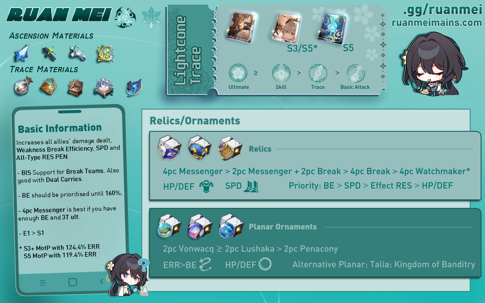

# Ruan Mei Quick Guide ❀
##### _Updated for 2.5; Written by mr.swedishfish and nv50_
> _"Humans overestimate the infallibility of logic, and in clinging to reason can become slaves to their emotions. Science is born from fanaticism — it is a gift."_

## Introduction
Too lazy to read the full guide? Don't worry, we've got the TLDR for you. 

## Guide Updates
??? edit "Patch 2.5 Updates"

    ## Guide Updates (Patch 2.5)
    The following are the newest additions and changes to our guide with the release of patch 2.5.

    ### Updated character Synergies and Anti-Synergies

    - **Misha** has been added to the list of **synergies**.

    - **Gallagher** has been added to the list of **synergies**.

    - **Harmony Trailblazer** has been added to the list of **synergies and character comparisons**.

    - **Boothill** has been added to the list of **synergies**.

    - **Robin** has been added to the list of **character comparisons**.

    - **Firefly** has been added to the list of **synergies**.

    - **Yunli** has been added to the list of **anti-synergies**.

    - **March 7th (Hunt)** has been added to the list of **synergies**.

    - **Lingsha** has been added to the list of **synergies**. 

    Read more about Ruan Mei's best and not-as-great teammates in our [Teammates Section](#teammates "Teammates Section") and read more about characters most often Ruan Mei is compared to in our [Character Comparisons](#character-comparisons "Character Comparisons") section!

    ### Updated Lightcone options

    - Added Sparkle's signature Light Cone, **Earthly Escapade**.

    - Added Robin's signature Light Cone, **Flowing Nightglow**.

    To know more abut how these Light Cones compare to already existing Light Cones, check out our updated [Light Cone Recommendations](#light-cones "Light Cone Recommendations") section for Ruan Mei!

    ### Updates to Relic set Recommendations
    - **Iron Cavalry Against the Scourge**.

    - **Watchmaker, Master of Dream Machinations**.

    - **Lushaka, the Sunken Seas**.

    Check out which relic sets and planar ornaments you can use on Ruan Mei in our [4PC Relic Set Recommendations](#4pc-relic-recommendations "4PC Relic Set Recommendations") and [2PC Planar Ornament Recommendations](#2pc-planar-ornament-recommendations "2PC Planar Ornament Recommendations") sections!

Ruan Mei is a 5-star Ice Harmony character and Member #81 of the Genius Society. Read this quick guide to learn how to optimize Ruan Mei effectively, find out her best builds, and see how she can fit into your teams!

## Ruan Mei TLDR
Ruan Mei is a support character capable of increasing allies' Weakness Break Efficiency, SPD, and All-Type RES PEN. At the same time, Ruan Mei can also deal additional Break DMG whenever allies Weakness Break an enemy, causing the Weakness Broken enemies' actions to be further delayed.

*[RES PEN]: Resistance Penetration
*[SP]: Skill Point
*[3T ult]: 3-Turn Ultimate
*[4T ult]: 4-Turn Ultimate
*[MotP]: Memories of the Past
*[PSiM]: Past Self in Mirror
*[HMC]: Harmony Trailblazer
*[FUA]: Follow-up Attack
*[BiS]: Best in Slot
*[EBA]: Enhanced Basic Attack
*[DoT]: Damage Over Time
*[ERR]: Energy Regeneration Rate

If you need a quick overview on Ruan Mei and how to build her, you can check the infographic below.

<figure markdown>
  
  <figcaption>Infographic designed by littlemari</figcaption>
</figure>

## Trace Priority

Ruan Mei's value comes from her ultimate and skill. As a Harmony character, she is not focused on dealing high amounts of damage. Rather, she focuses on buffing her own allies. Ruan Mei's ultimate and skill boost her allies' damage. Her ultimate increases the RES PEN of her allies, and her skill increases the overall damage and weakness break efficiency of her allies. Her talent also boosts the SPD of all allies in battle unconditionally as well as deal additional Break DMG when an enemy is weakness broken. Therefore, those are her valuable traces.

Ruan Mei's ascension traces are also quite decent. All her ascension traces are very useful in improving her support capabilities, and they should definitely be activated as a priority.

## Eidolon Overview

=== "E1: Neuronic Embroidery"
    
    { align=left width=200 }

    While the Ultimate's field is deployed, the DMG dealt by all allies ignores 20% of the target's DEF.

    * Ruan Mei's best eidolon
    * Between E1 and LC, prioritize E1
    * Offers unconditional DEF shred (think the first part of the 4PC Genius set)

=== "E2: Reedside Promenade"

    { align=left width=200 }

    With Ruan Mei on the field, all allies increase their ATK by 40% when dealing damage to enemies with Weakness Break.

    * Mediocre eidolon
    * Generic team-wide DMG increase
    * Allows for allies to use SPD boots

=== "E3: Viridescent Pirouette"

    { align=left width=200 }

    Ultimate Lv. +2, up to a maximum of Lv. 15. Talent Lv. +2, up to a maximum of Lv. 15.

    * Generally good eidolon
    * Levels up talent and ultimate, which is quite valuable
    * Not necessary for Ruan Mei

=== "E4: Chatoyant Éclat"

    { align=left width=200 }

    When an enemy target's Weakness is Broken, Ruan Mei's Break Effect increases by 100% for 3 turn(s).

    * Mediocre eidolon
    * Allows for stat redistribution
    * General increase in personal DMG

=== "E5: Languid Barrette"

    { align=left width=200 }

    Skill Lv. +2, up to a maximum of Lv. 15. Basic ATK Lv. +1, up to a maximum of Lv. 10.

    * Underwhelming eidolon
    * Ruan Mei's Basic ATK should be least prioritized
    * Only get E5 if you plan to get E6

=== "E6: Sash Cascade"

    { align=left width=200 }

    Extends the duration of the Ultimate's field by 1 turn(s). The Talent's Break DMG multiplier additionally increases by 200%.

    * Ruan Mei's second best eidolon
    * Higher ultimate uptime, which is very valuable
    * Significant increase in Ruan Mei's personal DMG

## Light Cones

| Light Cone  |Notes                                |
| ----------- |------------------------------------ |
| |  **Past Self in Mirror** is Ruan Mei's signature and best in slot light cone. It gives a lot of Break Effect for Ruan Mei, along with other benefits such as generating 1 SP after casting ULT and it regenerates 10 Energy per wave of battle. If you are deciding whether to pull for E1 or S1, **pull for E1**.|
|      | **Memories of the Past** is Ruan Mei's best 4-star light cone and a great budget alternative to PSiM. It provides Ruan Mei's most needed stats, Break Effect and energy. At **S5**, it competes with PSiM because it guarantees a 3T ultimate and is a direct upgrade to Meshing Cogs since it pretty much does what it does but better. |
|   | **Meshing Cogs**, a popular budget light cone choice for Harmony characters due to the energy it provides, is a very viable option for Ruan Mei. It's energy generating effect can directly be compared to that of MotP. |
|  | **Earthly Escapade** is Sparkle's signature light cone. The crit buff passive only has a 50% uptime at best, meaning most of it's value is being wasted and is better used by Sparkle herself and is NOT recommended.
|  | **Flowing Nightglow** is Robin's signature light cone. This lightcone may be a great source of additional energy however you can run MotP and Meshing Cogs for the same purpose. It's teamwide damage boost only has a 33% uptime, For those reasons this Light Cone is NOT recommended.
|  | **Dance! Dance! Dance!** is a possible option due to its basic utility, which advances forward all allies upon casting the wearer's ultimate. It can only be useful in very specific cases and is not recommended for general use.
|  |**Planetary Rendezvous** is an option for Ruan Mei if you are using her in Ice teams. However it is still not recommended over MotP or Meshing Cogs.
|  | **But the Battle Isn't Over**, Bronya's signature light cone, is generally NOT recommended unless at high superimpositions. The only parts of it that benefit Ruan Mei are the energy and SP it provides.

## Relic Sets

Ruan Mei mainly needs Break Effect, SPD, and Energy Regeneration Rate, as those are the stats that help improve her support capabilities the most. Because she is a support character and Break DMG cannot crit, offensive stats such as CRIT and ATK don't contribute anything to her playstyle. Do not invest in those.

### 4PC Relic Recommendations

Ruan Mei's 4PC Relic sets aren't that impactful for her or her team, so it is only recommended to use 4PC Relic sets if you want to further optimize your Ruan Mei build. In most cases using a 2PC Break/SPD or 2PC Break/Break etc.

=== "4PC Messenger Traversing Hackerspace"
    { align=left }
    
    Increases SPD by 6%. When the wearer uses their Ultimate on an ally, SPD for all allies increases by 12% for 1 turn.

    * Increases personal SPD
    * Increases SPD for all allies (about 25%-33% uptime)
    * Only recommended if you have enough Break Effect, SPD, and ultimate uptime

=== "2PC Thief/Watchmaker/Iron Cavalry, 2PC Hackerspace"
    { align=left width=128 }
    
    Increases the wearer's Break Effect by 16%. Increases SPD by 6%.

    * Increases Break Effect
    * Increases SPD
    * Recommended if you need a balance of additional SPD and Break Effect

=== "4PC Thief of Shooting Meteor"
    { align=left }
    
    Increases the wearer's Break Effect by 32%. When the wearer inflicts Weakness Break on an enemy, regenerates 3 Energy.
    
    * Greatly increases Break Effect
    * Regenerates energy for Ruan Mei if she breaks the enemy
    * Recommended if you are lacking Break Effect and/or ultimate uptime

=== "4PC Watchmaker, Master of Dream Machinations"
    { align=left }

    Increases the wearer's Break Effect by 16%. Increases Break Effect of all allies (including the wearer) by 30% for 2 turns upon using Ultimate.

    * Greatly increases Break Effect
    * Increases Break Effect for all allies (about 50%-66% uptime)
    * Only recommended if you are using a break-focused DPS and if no other ally is using this set

### 2PC Planar Ornament Recommendations

=== "Sprightly Vonwacq"
    { align=left }

    Increases the wearer's Energy Regeneration Rate by 5%. When the wearer's SPD reaches 120 or higher, the wearer's action is Advanced Forward by 40% immediately upon entering battle.

    * Increases Energy Regeneration Rate
    * Allows for higher ultimate uptime
    * Advances forward at the start of battle
    * If Ruan Mei's technique is used, saves 1 skill point

=== "Lushaka, the Sunken Seas"
    { align=left width=128 }

    Increases wearer's Energy Regeneration Rate by 5%. If the wearer is not the first character in the team lineup, then increases the ATK of the first character in the team lineup by 12%.

    * Increases Energy Regeneration Rate
    * Allows for higher ultimate uptime
    * Increases ATK% of the leftmost ally
    * Recommended for teams that make use of ATK%, like DoT teams

=== "Penacony, Land of the Dreams"
    { align=left }
    
    Increases wearer's Energy Regeneration Rate by 5%. Increases DMG by 10% for all other allies that are of the same Type as the wearer.

    * Increases Energy Regeneration Rate
    * Allows for higher ultimate uptime
    * Increases DMG% for matching-type teammates
    * Recommended if running with an Ice DPS

=== "Talia: Kingdom of Banditry"
    { align=left }

    Increases the wearer's Break Effect by 16%. When the wearer's SPD reaches 145 or higher, the wearer's Break Effect increases by an extra 20%.

    * Increases Break Effect
    * Does not provide energy, so ultimate uptime will be lower
    * Recommended if using Meshing Cogs

=== "Broken Keel"
    { align=left }

    Increases the wearer's Effect RES by 10%. When the wearer's Effect RES is at 30% or higher, all allies' CRIT DMG increases by 10%.

    * Increases allies' CRIT DMG
    * Ruan Mei does not really need Effect RES compared to other stats

### Relic Stats

### Relic Substat Priority

## Teammates

Due to her universal buffs, Ruan Mei can fit in most teams and can effectively support most DPS characters. Even characters who don't benefit as much from Break Effect still benefit form Ruan Mei due to her strong buffs. Below are some characters who can be paired with Ruan Mei.

### Notable Synergies

| Character   | Notes                            |
| ----------- | -------------------------------- |
|  | **Asta** is a great budget option to use with Ruan Mei. She naturally has incredible toughness damage, so she can break very often, which goes well with Ruan Mei's kit. Fire characters also have a high break multiplier, so a higher break effect allows for more break damage.
|  | **Silver Wolf** is a teammate who will pair well with Ruan Mei. Her main gimmick revolves around weakness implant, and Ruan Mei is focused around teams who will break the enemy. So naturally, they will be a decent pair.
|  | **Xueyi** gains a DMG boost based on her Break Effect, a stat that Ruan Mei increases for her allies. Furthermore, Xueyi's ultimate deals Toughness DMG regardless of their weakness element, which allows for easier breaking of the enemy.
|  | **Sushang** benefits from Break Effect, and she benefits greatly from enemies being weakness broken, making her a great option to go with Ruan Mei. Additionally, Sushang has high Weakness Break Efficiency, which allows her to break often. Physical characters also have a high break multiplier, so a higher break effect allows for more break damage.
|  | **Kafka** works well with Ruan Mei. This is because Ruan Mei's buffs, such as RES PEN and DMG% and SPD are extremely valuable in a DoT focused team where characters will have high ATK making other stat buffs which Ruan Mei provides more valuable. Additionally Breaking enemies will also apply an additional DoT on enemy if broken by the correct elements.
|  | **Welt** deals 20% more DMG to enemies inflicted with Weakness Break, making him a great option to pair with Ruan Mei.
|  | **Misha** benefits from the Penacony, Land of Dreams relic set on Ruan Mei as an Ice DMG dealer. While he doesn't exactly benefit from Ruan Mei's Break Effect buffs, his ultimate, which can freeze enemies, can help further delay enemy actions.
|  | **Gallagher** was introduced as the first break-focused Abundance character for patch 2.1. His kit allows enemies to receive more break DMG, and allies receive additional healing based on his Break Effect. With Ruan Mei on the team, who increases Break Effect and Weakness Break Efficiency, Gallagher's support capabilities are enhanced.
|  | **Harmony Trailblazer** works hand in hand with Ruan Mei as a powerful support duo for break-focused DPS characters. Their buffs don't have much overlap, which means they don't suffer from diminishing returns. When using a break-focused DPS character, using both HMC and Ruan Mei is a must.
|  | **Boothill** is the first limited 5-star character who is focused on break mechanics, released in patch 2.2. He wants his enemies to be Weakness Broken for maximum damage and Ruan Mei's weakness break efficiency really benefits him. It also makes it so that he can start stacking his Pocket Trickshot faster for higher damage output.
|  | **Firefly** is the second break-focused limited 5-star character, releasing in patch 2.3 alongside Ruan Mei's first rerun. Her damage is reliant on Break and Super Break mechanics which greatly benefit from Ruan Mei's weakness break efficiency boost and her RES PEN boost making them a great pair. However, the DMG boost Ruan Mei provides is practically useless for Firefly.
|  | **March 7th (Hunt)** takes on the role as a sub-DPS whose main source of damage comes from her Enhanced Basic Attack. March 7th can be built as either a crit-focused or break-focused sub-DPS, as she can deal high amounts of Toughness damage as well as raw damage from her EBA. With Ruan Mei on her team, March's damage output and Toughness reduction capabilities are greatly enhanced.
|  | **Lingsha** allows for more Break DMG upon using her ultimate, which pairs well with Ruan Mei. As a character who benefits from Break Effect and deals decent Toughness damage on her own, Lingsha makes great use of Ruan Mei's buffs and is a great addition to Super Break teams.

### Notable Anti-Synergies

| Character   | Notes                            |
| ----------- | -------------------------------- |
|  | **Clara** is one character who absolutely won't work with Ruan Mei. Clara relies on getting hit in order to counter enemies, but Ruan Mei helps keep enemies weakness broken. If enemies are broken, then Clara can't get hit.
|  | **Yunli** doesn't work with Ruan Mei for the same reasons Clara doesn't work with Ruan Mei. To maximize her damage output, Yunli relies on getting hit to counter enemies, which means that she does not want enemies to stay weakness broken.
|  | **Himeko** isn't the most anti-synergistic with Ruan Mei due to the fact that she wants to break as many enemies as possible. However, Ruan Mei also extends Weakness Break (her "second break" from her Thanatoplum Rebloom does not add any stacks for Himeko), which means that it will take longer for Himeko to gain stacks and trigger her follow-up attack. She can still be used with Ruan Mei because she benefits from Weakness Break buffs, but she will have a harder time gaining stacks.
|  | **Seele** is also in a similar boat as Himeko. She isn't the most anti-synergistic with Ruan Mei, and she greatly benefits from her buffs, making Ruan Mei a decent pick for Seele. However, Ruan Mei's Thanatoplum Rebloom from her ultimate can accidentally "steal" Seele's kills, preventing Seele from triggering her Resurgence passive. This can be worked around, but it needs to be considered when using Ruan Mei and Seele together.

### Team Composition Examples
Below are some example team compositions for Ruan Mei. These are not the only team compositions that can be used with Ruan Mei. Rather, they are some notable examples to help players have an idea on how to use Ruan Mei.
#### Super Break

#### Kafka DoT

#### Follow-Up

#### Dual Carry

#### Hypercarry

## Character Comparisons
Ruan Mei may be the first limited 5-star Harmony character, but she isn't the only support character in the game. There are many other great characters to use, and many may wonder how she may compare to those characters.

| Character   | Notes                            |
| ----------- | -------------------------------- |
|  | **Bronya** is focused on buffing her allies' DMG dealt. However, that is where their similarities end. Bronya is focused on single-target buffs, while Ruan Mei buffs the entire team at once. Furthermore, Bronya's kit revolves around increasing ATK% and CRIT DMG, whereas Ruan Mei's kit focuses on increasing Weakness Break Efficiency, Break Effect, and SPD. Because they are so different, it is better to consider what you need and which DPS character you are using.
|  | **Tingyun** is generally regarded as one of the best 4* characters in the game due to her utility of restoring energy for an ally. Both of them only have one thing in common, them buffing allies DMG dealt. Other than that both of them are used for different purposes.
|  | **Asta** provides a lot of value due to her ATK% buffs and her huge flat SPD boost from her ultimate. While Ruan Mei and Asta may seem similar due to the fact that they both provide buffs and increase SPD, they are quite different. Ruan Mei buffs DMG%, while Asta buffs ATK%. This makes Asta someone who runs very well with Ruan Mei, rather than someone to be replaced by Ruan Mei.
|  | **Pela** is a Nihility character, while Ruan Mei is a Harmony character. Because Ruan Mei and Pela are both different characters who provide different things, it is again recommended to run them together if possible. However, if you must choose one or the other, choose whoever benefits your DPS more.
|  | **Yukong** is generally regarded as an unfavorable Harmony character due to her being difficult to get full value out of. Ruan Mei and Yukong provide different buffs and can be ran together in some cases, but Ruan Mei is generally preferred over Yukong if there is a choice between the two.
|  | **Harmony Trailblazer** can be seen as a "discount Ruan Mei" of sorts at first glance, as both are Harmony characters who focus on break-related buffs. However, they both provide something unique to the table. Ruan Mei provides Weakness Break extension and prolonged Weakness Break efficiency buffs. HMC's main gimmick is their Super Break which has it's damage directly scaled by the toughness reducing damage. It is strongly recommended to run Ruan Mei alongside HMC if you choose to run HMC.
|  | **Robin** is considered to be similar to Ruan Mei due to their teamwide buffing capabilities. Generally speaking Ruan Mei is preferred inside of Break and sometimes DoT teams. In other cases like in FUA or Hypercarry, Robin is preferred.

## Frequently Asked Questions
If you didn't read through this guide thoroughly, you probably don't know the answers to these commonly asked questions, but don't worry. If you just skipped to the end to find the answers to these questions, we've got you covered.

### E1 or Signature Light Cone?
Ruan Mei's **E1** is highly recommended over her light cone. There are a couple great alternatives to Ruan Mei's signature light cone.

Conversely, Ruan Mei's E1 is incredibly valuable. As her best eidolon, it ignores 20% DEF during Ruan Mei's ultimate. 

### ERR or BE rope?
The only relic with an Energy Regeneration main stat is the link rope, so that is the only Energy Regeneration you can possibly obtain via relic main stats. Because Ruan Mei's ultimate is so powerful, it is highly recommended to have as much Energy Regeneration as possible. This is why **ERR rope is recommended over BE rope**.

### Is 4PC Watchmaker, Master of Dream Machinations Ruan Mei's new BiS set?
The short answer is: no, 4PC Watchmaker is not Ruan Mei's BiS. For general usage, Ruan Mei's other relic set options such as 4PC Messenger Traversing Hackerspace, 2PC Break Effect 2PC Messenger, and 4PC Thief of Shooting Meteor are better options.

### Is 3T Ult Really Necessary?
While a 3T ult is optimal, it's not necessary. It is better to focus on achieving the minimum amount of Break Effect (180%) before focusing on achieving a 3T ult. However, even if you cannot achieve a 3T ult, still aim for as high ultimate uptime as possible. Ruan Mei's ultimate is very valuable, so the more you can cast your ultimate, the better.

### How much Break Effect can I sacrifice for 3T Ult?
It is recommended to first aim for 180% Break Effect, then to focus on 3T ult. If you have less than **160%** Break Effect, it is better to settle for a 4T ult instead, as losing out on the recommended Break Effect negatively affects Ruan Mei more than having less ultimate uptime. However, it is not recommended to settle for anything more than a 4T ult.

## Closing & Final Thoughts
In conclusion, Ruan Mei is a strong buffer who can fit in most team. She has withstood the test of time and is an extremely valuable unit as of 2.5. She isn't meant to replace other Harmony units, but she shines in her own way in her break focused teams.

Huge thanks to our Theorycrafting Team for their work in creating this guide! From working on calculations to answering questions, their contributions have been invaluable.

This guide will be updated as future content updates and changes Ruan Mei's recommended playstyle. Thanks for reading, and we hope you found this guide helpful!
