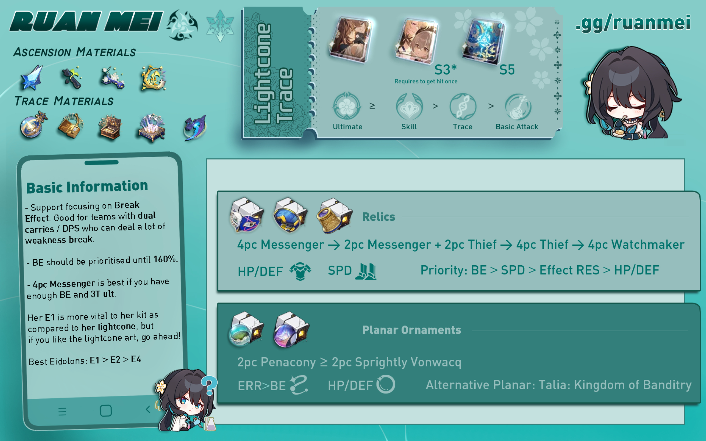

# Ruan Mei Quick Guide ❀
##### _Updated for 1.6; Written by mr.swedishfish, Edited by sealary_
> _"We may accelerate or postpone the arrival of death, but life will always wither. Though we will one day all be reduced to particles, we can still reach new heights."_

## Introduction
Too lazy to read the full guide? Don't worry, we've got the TLDR for you. 

Ruan Mei is a 5-star Ice Harmony character and Member #81 of Genius Society. She is an incredibly flexible unit who can fit in any team with her universal buffs. Read this guide to learn how to optimize Ruan Mei effectively and see how she can fit in your teams!

## Ruan Mei TLDR
Ruan Mei is a support character capable of increasing allies' Weakness Break Efficiency, SPD, and All-Type RES PEN(1). At the same time, Ruan Mei can also deal additional Break DMG whenever allies Weakness Break an enemy, causing the Weakness Broken enemies' actions to be further delayed.
{ .annotate }

1.  RES PEN is short for resistance penetration. What is RES PEN and how does it work? Check out the Trace Overview section in our [Ruan Mei Full Guide](full.md) and read more about it in her Ultimate description!

If you need a quick overview on how to build Ruan Mei, you can check the infographic below.

<figure markdown>
  
  <figcaption>Infographic designed by littlemari</figcaption>
</figure>

## Pros and Cons
Why should you use and build Ruan Mei? Should you pull for Ruan Mei over other units? While she is admittedly a luxury pick for most people as a limited 5-star character, she still provides a lot of utility as a strong support character. She's not a "must-pull," but she's still a great unit.

=== "PROS"
    { align=left }

    - Ruan Mei's ultimate provides All-Type RES PEN, which is very valuable
    - She is a highly flexible team-wide support
    - Unlike DPS units, Ruan Mei is future-proof
    - She is SP (super pretty!) positive

=== "CONS"
    { align=left }

    - Ruan Mei is a limited 5-star character, so she's not as easily accessible as other characters
    - Ruan Mei doesn't replace existing Harmony characters who are already considered very good
    - Ruan Mei is not a "must pull" for your account

## Trace Priority

Ruan Mei's value comes from her ultimate and skill. As a Harmony character, she is not focused on dealing high amounts of damage. Rather, she focuses on buffing her own allies. Ruan Mei's ultimate and skill boost her allies' damage. Her ultimate increases the RES PEN of her allies, and her skill increases the overall damage and weakness break efficiency of her allies. Therefore, those are her two most valuable traces.

Ruan Mei's ascension traces are also quite decent. Her second and fourth ascension traces are very useful in improving her support capabilities, and they should definitely be activated.

## Eidolon Overview

=== "E1: Neuronic Embroidery"
    
    { align=left width=200 }

    While the Ultimate's field is deployed, the DMG dealt by all allies ignores 20% of the target's DEF.

    * Ruan Mei's best eidolon
    * Between E1 and LC, prioritize E1
    * Offers unconditional DEF shred (think 4PC Genius set)

=== "E2: Reedside Promenade"

    { align=left width=200 }

    With Ruan Mei on the field, all allies increase their ATK by 40% when dealing damage to enemies with Weakness Break.

    * Mediocre eidolon
    * Generic team-wide DMG increase
    * Allows for allies to use SPD boots

=== "E3: Viridescent Pirouette"

    { align=left width=200 }

    Ultimate Lv. +2, up to a maximum of Lv. 15. Talent Lv. +2, up to a maximum of Lv. 15.

    * Generally good eidolon
    * Levels up talent and ultimate, which is quite valuable
    * Not necessary for Ruan Mei

=== "E4: Chatoyant Éclat"

    { align=left width=200 }

    When an enemy target's Weakness is Broken, Ruan Mei's Break Effect increases by 100% for 3 turn(s).

    * Mediocre eidolon
    * Allows for stat redistribution
    * General increase in personal DMG

=== "E5: Languid Barrette"

    { align=left width=200 }

    Skill Lv. +2, up to a maximum of Lv. 15. Basic ATK Lv. +1, up to a maximum of Lv. 10.

    * Underwhelming eidolon
    * Ruan Mei's Basic ATK should be least prioritized
    * Only get E5 if you plan to get E6

=== "E6: Sash Cascade"

    { align=left width=200 }

    Extends the duration of the Ultimate's field by 1 turn(s). The Talent's Break DMG multiplier additionally increases by 200%.

    * Ruan Mei's second best eidolon
    * Higher ultimate uptime, which is very valuable
    * Significant increase in Ruan Mei's personal DMG

## Light Cones

| Light Cone  | Notes                                |
| ----------- | ------------------------------------ |
| | **Past Self in Mirror** is Ruan Mei's signature light cone. While it doesn't provide a lot of energy to ensure a 3T ultimate, it provides a lot of Break Effect and team-wide utility, allowing you to invest in other stats. |
|      |  **Memories of the Past** is Ruan Mei's best 4-star light cone. It provides Ruan Mei's most needed stats, break effect and energy. At **S3+**, Ruan Mei only needs to be hit once to ensure a 3T ultimate. At **S5**, it competes with Ruan Mei's signature light cone because it guarantees a 3T ultimate. |
|   |  **Meshing Cogs** is a very viable option for Ruan Mei. Because it is a 3-star light cone, it is easily accessible for F2P players. At **S5**, this light cone outperforms S2 Memories of the Past.|
|  | TBD% | **Earthly Escapade** is Sparkle's signature light cone. While it doesn't provide any energy, which also means its crit buff passive only has about 50% uptime, the buffs it provides still prove useful. However, it is a much more viable option for Sparkle, as it is tailor-made for her.
|  |  **Dance! Dance! Dance!** is a possible option due to its basic utility, which advances forward all allies upon casting the wearer's ultimate. However, because it does not provide any of Ruan Mei's needed stats, it is not recommended over the above options.
|  |  **Planetary Rendezvous** is an option for Ruan Mei if you are using her in Ice teams. However, Ruan Mei already provides DMG buffs for her allies, and having more leads to diminishing returns. Furthermore, this light cone does not provide Break Effect or Energy, Ruan Mei's most needed stats.
|  | **But the Battle Isn't Over** is generally NOT recommended unless at high superimpositions. The only part of it that benefits Ruan Mei is the energy it provides, but it is not enough to justify using it over the above options.

## Relic Sets

Ruan Mei needs mainly Break Effect, SPD, and Energy Regeneration Rate, as those are the stats that help improve her support capabilities the most. Because Ruan Mei is a support character, and Break DMG cannot crit, it is useless to focus on offensive stats such as CRIT and ATK. Below are some relic recommendations to optimize Ruan Mei.

### 4PC Relic Recommendations

=== "4PC Thief of Shooting Meteor"
    { align=left }
    
    * Greatly increases Break Effect
    * Regenerates energy for Ruan Mei if she breaks the enemy
    * Recommended if you are lacking Break Effect and/or ultimate uptime

=== "2PC Thief 2PC Hackerspace"

    { align=left }

    * Increases Break Effect
    * Increases SPD
    * Recommended if you are lacking SPD

=== "4PC Messenger Traversing Hackerspace"

    { align=left }

    * Increases Break Effect
    * Increases SPD for all allies
    * Recommended only if you have enough Break Effect and ultimate uptime

=== "4PC Watchmaker, Master of Dream Machinations"
    { align=left }

    * Greatly increases Break Effect
    * Increases Break Effect for all allies
    * Only recommended if you are using a break-focused DPS

### 2PC Planar Ornament Recommendations

=== "Sprightly Vonwacq"
    { align=left }

    * Increases Energy Regeneration Rate
    * Allows for higher ultimate uptime
    * Advances forward at the start of battle
    * If Ruan Mei's technique is used, saves 1 skill point

=== "Penacony, Land of the Dreams"

    { align=left }
    
    * Increases Energy Regeneration Rate
    * Allows for higher ultimate uptime
    * Increases DMG% for matching-type teammates
    * Recommended if running with an Ice DPS

=== "Talia: Kingdom of Banditry"

    { align=left }

    * Increases Break Effect
    * Does not provide energy, so ultimate uptime will be lower

=== "Broken Keel"

    { align=left }

    * Increases allies' CRIT DMG
    * Does not provide energy, so ultimate uptime will be lower
    * Effect RES can be obtained via other sources

### Relic Stats

### Stat Priority

## Teammates

Ruan Mei works with pretty much every character, except for Clara. Due to her universal buffs, Ruan Mei can fit in most teams and can effectively support most DPS characters. If you're wondering if Ruan Mei can work well with your main DPS, the answer is yes if they're not Clara. Below are some characters who work particularly well with Ruan Mei.

### Notable Synergies

| Character   | Notes                            |
| ----------- | -------------------------------- |
|  | **Asta** is a great budget option to use with Ruan Mei. Her multi-hit skill allows her to break very easily. Fire characters also have a high break multiplier, so a higher break effect allows for more break damage. Furthermore, both Asta and Ruan Mei buff speed, granting you several turns per cycle. Asta also buffs ATK% while Ruan Mei buffs DMG%, which allows for less diminishing returns.
|  | **Silver Wolf** is a teammate who will pair well with Ruan Mei. Her main gimmick revolves around weakness implant, and Ruan Mei is focused around teams who will break the enemy. Silver Wolf is an efficient breaker whose DEF shred synergizes well with Ruan Mei, bringing out her full potential.
|  | **Xueyi** gains a DMG boost based on her Break Effect, a stat that Ruan Mei increases for her allies. Furthermore, Xueyi's ultimate deals Toughness DMG regardless of their weakness element, which allows for easier breaking. Xueyi is also a 4-star character, making her more accessible for F2P players.
|  | **Sushang** benefits from Break Effect, and she benefits greatly from enemies being weakness broken, making her a great option to go with Ruan Mei. Additionally, Sushang has high weakness break efficiency, which allows her to break often. Physical characters also have a high break multiplier, so a higher break effect allows for more break damage. Furthermore, Sushang is a 4-star character, which means she is more accessible for F2P players.
|  | **Kafka** works extremely well with Ruan Mei. The RES PEN and DMG% from Ruan Mei's kit affects DoT, which will still occur due to Kafka's kit. Furthermore, breaking enemies also adds more DoT, and the break effect from Ruan Mei increases break DoT strength.
|  | **Welt** deals 20% more DMG to enemies inflicted with Weakness Break, making him a great option to pair with Ruan Mei. He also slows enemies, which is a great utility to have and one that synergizes quite well with Ruan Mei.
|  | **Misha** is a new 4-star Ice DPS character for patch 2.0. He benefits from the Penacony, Land of Dreams relic set on Ruan Mei as an Ice DMG dealer. Furthermore, due to his rarity, he is considered a budget option who is more accessible for F2P players. While he doesn't exactly benefit from Ruan Mei's Break Effect buffs, his ultimate, which can freeze enemies, can help further delay enemy actions.

### Notable Anti-Synergies

| Character   | Notes                            |
| ----------- | -------------------------------- |
|  | **Clara** is one character who absolutely won't work with Ruan Mei. Clara relies on getting hit in order to counter enemies, but Ruan Mei helps keep enemies weakness broken. If enemies are broken, then Clara can't get hit.
|  | **Himeko** isn't the most anti-synergistic with Ruan Mei due to the fact that she wants to break as many enemies as possible. However, Ruan Mei also extends weakness break, which means that it will take longer for Himeko to gain stacks and trigger her follow-up attack. She can still be used with Ruan Mei, but she is not really a recommended option.
|  | **Seele** is also in a similar boat as Himeko. She isn't the most anti-synergistic with Ruan Mei, and she greatly benefits from her buffs, making Ruan Mei a top pick for Seele. However, Ruan Mei's Thanatoplum Rebloom from her ultimate can accidentally "steal" Seele's kills, preventing Seele from triggering her Resurgence passive. This can be worked around, but it needs to be considered when using Ruan Mei and Seele together.

### Team Composition Examples
Below are some example team compositions for Ruan Mei. These are not the only team compositions that can be used with Ruan Mei. Rather, they are some notable examples to help players have an idea on how to use Ruan Mei.

#### Kafka DoT

#### Topaz Follow-Up

#### Dual Carry

#### Hypercarry

## Frequently Asked Questions
Below are some frequently asked questions regarding Ruan Mei. If you skipped to the end to find answers to these questions, we've got you covered.

### E1 or Signature Light Cone?
Ruan Mei's **E1** is highly recommended over her light cone. There are a couple great alternatives to Ruan Mei's signature light cone, and at high superimpositions, they may even outperform Ruan Mei's light cone. This is because Ruan Mei's light cone does not provide enough energy to ensure a 3T ult, and the Break Effect it gives at S1 is comparable to the amount of Break Effect S5 Memories of the Past gives.

Conversely, Ruan Mei's E1 is incredibly valuable. It is her best eidolon; it ignores 20% DEF during Ruan Mei's ultimate. This is basically like having 4PC Genius of Brilliant Stars, which is a popular relic set for even non-Quantum DPS characters. That's how good DEF shred is.

### ERR or BE rope?
It is recommended to run an **ERR rope** over a BE rope. Ruan Mei's ultimate is very valuable and provides All-Type RES PEN, a very helpful buff. Energy Regeneration is also not easily obtained, as it cannot be gained via relic substats. The only relic with an Energy Regeneration main stat is the link rope, so that is the only Energy Regeneration you can possibly obtain via relics.

Break Effect, on the other hand, can be obtained via relic substats, Thief of Shooting Meteor, and Ruan Mei's traces. It is not difficult to reach the recommended 180% without a BE rope.

Because Ruan Mei's ultimate is so powerful, it is highly recommended to have as much Energy Regeneration as possible. This is why ERR rope is recommended over BE rope.

### Is 3T Ult Really Necessary?
It is not necessary to be able to perform a 3T ult. However, a 3T ult is optimal. It is still recommended to try to aim for as high ultimate uptime as possible, even if you cannot achieve a 3T ult. Ruan Mei's ultimate is very valuable, so the more you can cast your ultimate, the better.

### How much Break Effect can I sacrifice for 3T Ult?
It is recommended to first aim for 180% Break Effect, then to focus on 3T ult. If you have less than **170%** Break Effect, it is better to settle for a 4T ult instead, as losing out on the recommended Break Effect negatively affects Ruan Mei more than having less ultimate uptime. However, it is not recommended to settle for anything more than a 4T ult. A 5T ult is not recommended, and using an ERR rope is still recommended over a Break Effect rope. For more information on Ruan Mei's energy needs, you can check out our [Full Guide](full.md).

### How much Break Effect is too much?
While the recommended minimum Break Effect is 180%, you can definitely have more Break Effect. There is no limit to how much Break Effect to have, but you should not be sacrificing other stats for Break Effect. Once you hit 180% Break Effect, focus on other stats; if you have extra Break Effect to spare even after hitting the recommended stats, that's perfectly fine.

### Can I run a Break Effect rope?
In all situations, a Break Effect rope should only be used if you do not have an ERR rope. This goes for when you cannot reach 180% Break Effect as well. Even with other energy sources, having an ERR rope is still recommended. It is generally more beneficial for your team to cast Ruan Mei's ultimate more often, and an ERR rope is the largest source of energy for any character. Sacrificing over 19% energy for more Break Effect, which is a stat that can be obtained via relic substats, is not worth it.

## Closing & Final Thoughts
In conclusion, Ruan Mei is a strong buffer who can fit in any team. She is future-proof and will remain a strong unit even in the future. Ruan Mei might be a luxury option, and she isn't meant to replace other Harmony units, but she shines in her own way. Also, it gives players a chance to invest in a stat that wasn't commonly invested in before.

This guide will be updated as we are able to test Ruan Mei during 1.6 and as future content changes Ruan Mei's playstyle. Thanks for reading, and we hope you found this guide helpful!
